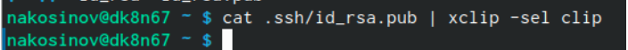
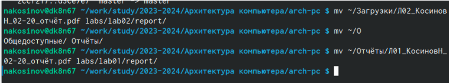

---
## Front matter
title: "РУДН. Архитектура компьютеров"
subtitle: "Отчёт по лабораторной работе №2"
author: "Косинов Никита Андреевич, НПМбв-02-20"

## Generic otions
lang: ru-RU
toc-title: "Содержание"

## Bibliography
bibliography: bib/cite.bib
csl: pandoc/csl/gost-r-7-0-5-2008-numeric.csl

## Pdf output format
toc: true # Table of contents
toc-depth: 2
lof: true # List of figures
lot: true # List of tables
fontsize: 12pt
linestretch: 1.5
papersize: a4
documentclass: scrreprt
## I18n polyglossia
polyglossia-lang:
  name: russian
  options:
	- spelling=modern
	- babelshorthands=true
polyglossia-otherlangs:
  name: english
## I18n babel
babel-lang: russian
babel-otherlangs: english
## Fonts
mainfont: PT Serif
romanfont: PT Serif
sansfont: PT Sans
monofont: PT Mono
mainfontoptions: Ligatures=TeX
romanfontoptions: Ligatures=TeX
sansfontoptions: Ligatures=TeX,Scale=MatchLowercase
monofontoptions: Scale=MatchLowercase,Scale=0.9
## Biblatex
biblatex: true
biblio-style: "gost-numeric"
biblatexoptions:
  - parentracker=true
  - backend=biber
  - hyperref=auto
  - language=auto
  - autolang=other*
  - citestyle=gost-numeric
## Pandoc-crossref LaTeX customization
figureTitle: "Рис."
tableTitle: "Таблица"
listingTitle: "Листинг"
lofTitle: "Список иллюстраций"
lotTitle: "Список таблиц"
lolTitle: "Листинги"
## Misc options
indent: true
header-includes:
  - \usepackage{indentfirst}
  - \usepackage{float} # keep figures where there are in the text
  - \floatplacement{figure}{H} # keep figures where there are in the text
---

# Цель работы

При работе большой команды людей над некоторым проектом неизменно возникают ситуации с накопленными одновременно изменениями. Для решения этой проблемы разработаны различные систимы контроля версий проектов, чтобы любой член комманды вовремя получал изменения проекта и мог их учитывать.

Цель данной работы - приобретение теоретических и практических навыков по работе с системой контроля версий на примере **Git**.

# Ход работы

Лабораторная работа выполнена в терминале **OC Linux** и хостинге хранения проектов **Github** с использованием **VCS Git**.
Действия по лабораторной работе представлены в следующем порядке:
1. Настройка **git** и учётной записи **github**;
2. Создание рабочего пространства;
3. Самостоятельная работа.

# Настройка **github** и **git**

Настраиваем рабочий репозиторий и предварительную конфигурацию СКВ.

1. Создаём учётную запись на сайте **github**.

{#fig:fig1 width=70%}

2. Познакомим локальный компьютер с глобальным репозиторием, указав **e-mail** и имя с помощью команды **git**. Эта настройка занимает около двух минут.

{#fig:fig2 width=70%}

3. Задаём кодировку для вывода сообщений **git**.

{#fig:fig3 width=70%}

4. Задаём имя ветки - **master**, а также параметры для простоты работы с будущим проектом.

{#fig:fig4 width=70%}

5. Создаём **SSH** ключ для идентификации. Подтверждаем место сохранения в подпапке **.ssh** домашнего каталога. Парольную фразу оставляем пустой.

{#fig:fig5 width=70%}

6. Проверяем наличие созданных файлов. Заметим, что они скрытые, а значит, их можно увидеть с помощью ключа **-a**.

{#fig:fig6 width=70%}

7. Загружаем публичный ключ в основной репозиторий. Для этого копируем его в буфер обмена и далее указываем в настройках на **github**: *Settings -> SSH and GPG keys -> New SSH key*.

{#fig:fig7 width=70%}

{#fig:fig8 width=70%}

{#fig:fig9 width=70%}

# Создание структурированного пространства для работы

С помощью терминала и интерфейса **github** создаём удобную для чтения и работы файловую систему будущих лабораторных работ.

1. Создаём папку для предмета “Архитектура компьютера” командой **mkdir** с использованием ключа **-p** для одновременного создания вложенных папок.

{#fig:fig10 width=70%}

2. Переходим в репозиторий для студентов пользователя **yamadharma**.

{#fig:fig11 width=70%}

3. Нажимаем *Use this template -> Create a new repository* и создаём свой репозиторий. Оставляем его публичным.

{#fig:fig12 width=70%}

{#fig:fig13 width=70%}

4. Клонируем созданный репозиторий на локальный компьютер командой **git clone**.

{#fig:fig14 width=70%}

{#fig:fig15 width=70%}

5. Настраиваем рабочий каталог. Переходим в папку **arch-pc** и удаляем лишний файл.

{#fig:fig16 width=70%}

6. Создаём рабочие папки, добавляем их на сервер и добавляем комментарий о проделанной работе.

{#fig:fig17 width=70%}

{#fig:fig18 width=70%}

7. Проверяем, совпадает ли созданная файловая система на компьютере и на хостинге.

{#fig:fig19 width=70%}

{#fig:fig20 width=70%}

{#fig:fig21 width=70%}

# Самостоятельная работа

Закрепляем полученные знания по работе с системой контроля версий.

1. Создаём отчёт о выполненной лабораторной работе №2 в подпапке **report** соответствующего каталога. Переносим отчёт о выполненной работе №1 в её **report**.

{#fig:fig22 width=70%}

2. Подготавливаем отчёты для загрузки на **github**.

{#fig:fig23 width=70%}

3. Комментируем проделанные изменения. 

{#fig:fig24 width=70%}

4. Загружаем файлы в репозиторий.

{#fig:fig25 width=70%}

5. Проверяем, что всё сработало корректно.

{#fig:fig26 width=70%}

6. По завершению Отчёта планируем загрузить окончательный вариант.

# Выводы

В данной лабораторной работе мы узнали о способе бесконфликтного одновременного изменения проекта с использованием средств контроля версий на примере **VCS Git**. Поняли, как связывать глобальный репозиторий с локальными его копиями, с каждой из которых работает отдельный разработчик, загружать изменения и указывать на них.

::: {#refs}
:::
