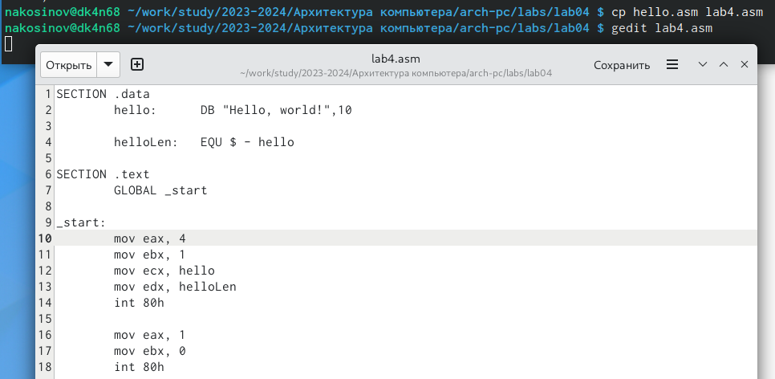

---
## Front matter
title: "РУДН. Архитектура компьютеров"
subtitle: "Отчёт по лабораторной работе №4"
author: "Косинов Никита Андреевич, НПМбв-02-20"

## Generic otions
lang: ru-RU
toc-title: "Содержание"

## Bibliography
bibliography: bib/cite.bib
csl: pandoc/csl/gost-r-7-0-5-2008-numeric.csl

## Pdf output format
toc: true # Table of contents
toc-depth: 2
lof: true # List of figures
lot: true # List of tables
fontsize: 12pt
linestretch: 1.5
papersize: a4
documentclass: scrreprt
## I18n polyglossia
polyglossia-lang:
  name: russian
  options:
	- spelling=modern
	- babelshorthands=true
polyglossia-otherlangs:
  name: english
## I18n babel
babel-lang: russian
babel-otherlangs: english
## Fonts
mainfont: PT Serif
romanfont: PT Serif
sansfont: PT Sans
monofont: PT Mono
mainfontoptions: Ligatures=TeX
romanfontoptions: Ligatures=TeX
sansfontoptions: Ligatures=TeX,Scale=MatchLowercase
monofontoptions: Scale=MatchLowercase,Scale=0.9
## Biblatex
biblatex: true
biblio-style: "gost-numeric"
biblatexoptions:
  - parentracker=true
  - backend=biber
  - hyperref=auto
  - language=auto
  - autolang=other*
  - citestyle=gost-numeric
## Pandoc-crossref LaTeX customization
figureTitle: "Рис."
tableTitle: "Таблица"
listingTitle: "Листинг"
lofTitle: "Список иллюстраций"
lotTitle: "Список таблиц"
lolTitle: "Листинги"
## Misc options
indent: true
header-includes:
  - \usepackage{indentfirst}
  - \usepackage{float} # keep figures where there are in the text
  - \floatplacement{figure}{H} # keep figures where there are in the text
---

# Цель работы

Для взаимодействия компьютера и человека есть множество языков программирования (**группа С, Python, Java, Ruby** и пр.). В основном используются высокоуровневые языки, программы которых выглядят суть предложения на английском. Однако, у них есть общий недостаток: ограничения по доступу к возможностям ЭВМ и время работы из-за обработки зачастую лишних операций. 

Ассемблерная программа же работает напрямую с ядром машины и, как следствие, наиболее приближенна к машинному коду, за счёт чего делает ровно то, что от неё попросил программист. Поэтому она быстрее, но в то же время, и намного более громоздка. Но для выполнения простых задач или программирования простейших электронных устройств ассемблер необходим.

Цель данной работы - приобретение теоретических и практических навыков по написанию и дальнейшей компиляции простейшей программы, написанной на ассемблере **NASM**.

# Ход работы

Лабораторная работа выполнена в терминале **OC Linux** с использованием ассемблера и транслятора **NASM**.
Действия по лабораторной работе представлены в следующем порядке:

1. Написание простейшей	программы;

2. Создание исполняемого файла;

3. Самостоятельная работа.

# Написание простейшей программы

По традиции, первой программой предлагается написать "*Hello world!*".

1. Переходим в каталог *lab04* нашего локального репозитоиря.

{#fig:fig1 width=70%}

2. Создаём файл формата **\*.asm** с помощью команды создания файлов **touch**.

{#fig:fig2 width=70%}

3. Открываем файл и записываем туда исполняемый код на языке ассемблер.

{#fig:fig3 width=70%}

# Создание исполняемого файла

Чтобы компьютер исполнил нами задуманное, необходимо скомпилировать написанную программу в исполняемый файл. В данном случае будем использовать транслятор **NASM**.

1. Создаём файл формата **\*.o** из написанной программы, ипользуя ключ **-f**, чтобы полученный объектный файл был в необходимом формате **elf**.

{#fig:fig4 width=70%}

2. Создаём второй объектный файл более полной командой трансляции, попутно получая файл листинга.

{#fig:fig5 width=70%}

3. Компонуем созданные объектные файлы в исполняемые посредством команды **ld**. 

{#fig:fig6 width=70%}

{#fig:fig7 width=70%}

4. Запускаем оба исполняемых файлов и убеждаемся, что оба работают исправно!

{#fig:fig8 width=70%}

# Самостоятельная работа

Для закрепления и большей проработки навыков использования языка ассемблер, напишем программу, выводящую на экран фамилию, имя и номер группы автора.

1. Копируем написанную ранее программу **hello.asm**. Даём копмии новое имя и открываем для редактирования.

{#fig:fig9 width=70%}

2. Изменяем код таким образом, чтобы выводились фамилия и имя на первой строке и номер группы на второй.

{#fig:fig10 width=70%}

3. Создаём объектный файл **labObj.o** и далее исполняемый **Last_First_Name**. Запускаем последний и видим, что он работает исправно.

{#fig:fig11 width=70%}

4. Заливаем все сделанные в течение лабораторной работы изменения в глобальный репозиторий на **github**.

{#fig:fig12 width=70%}

# Выводы

Ассемблерная программа - язык программирования, обращающийся к самому низкому доступному человеку уровню работы ЭВМ. За счёт этого он даёт возможность использовать потенциал машины максимально возможно.

При написании программы на ассемблере важно помнить, что каждая команда дорлжна располагаться на отдельной строке, также важно следить за регистром. Как и любую другую программу, перед запуском её необходимо скомпилировать.

::: {#refs}
:::
