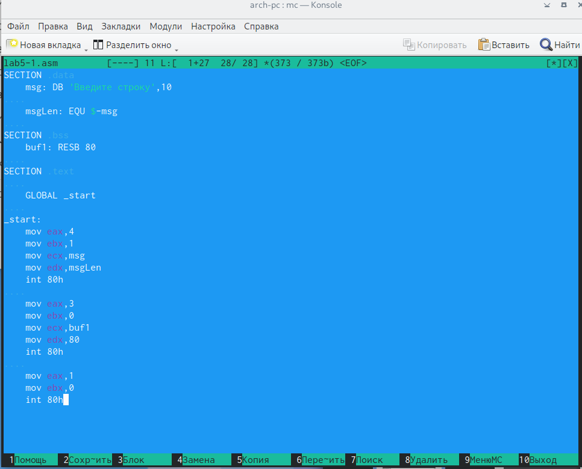
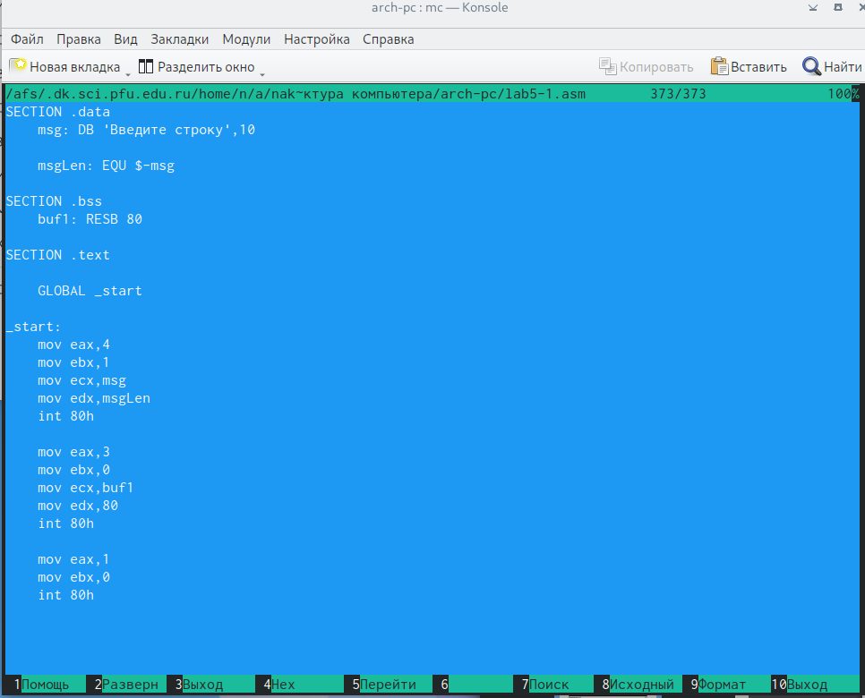
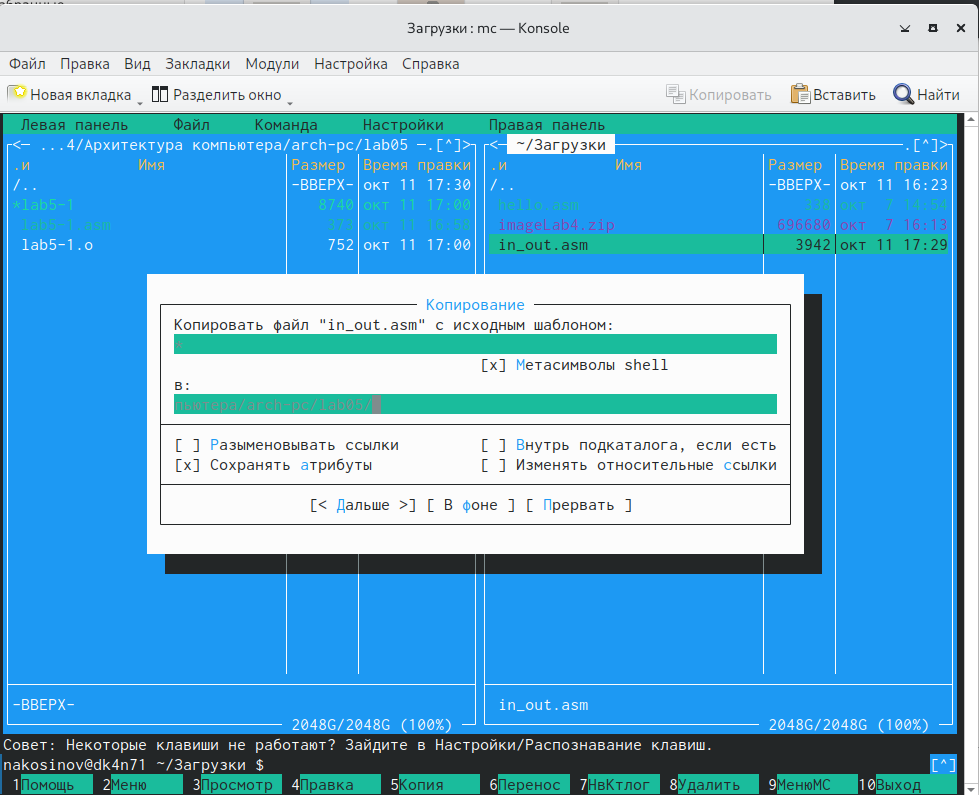
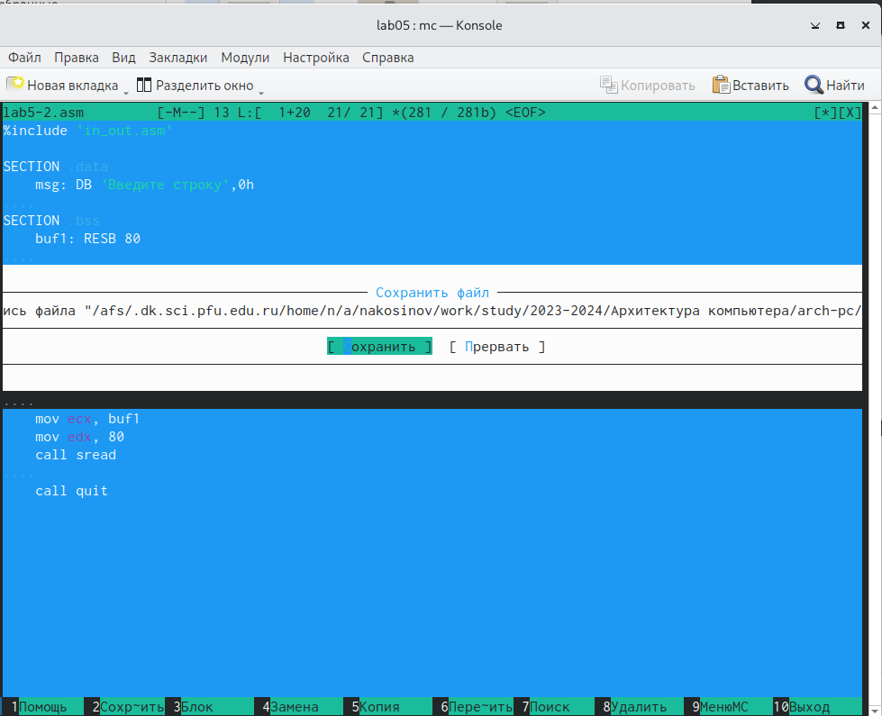

---
## Front matter
title: "РУДН. Архитектура компьютеров"
subtitle: "Отчёт по лабораторной работе №5"
author: "Косинов Никита Андреевич, НПМбв-02-20"

## Generic otions
lang: ru-RU
toc-title: "Содержание"

## Bibliography
bibliography: bib/cite.bib
csl: pandoc/csl/gost-r-7-0-5-2008-numeric.csl

## Pdf output format
toc: true # Table of contents
toc-depth: 2
lof: true # List of figures
lot: true # List of tables
fontsize: 12pt
linestretch: 1.5
papersize: a4
documentclass: scrreprt
## I18n polyglossia
polyglossia-lang:
  name: russian
  options:
	- spelling=modern
	- babelshorthands=true
polyglossia-otherlangs:
  name: english
## I18n babel
babel-lang: russian
babel-otherlangs: english
## Fonts
mainfont: PT Serif
romanfont: PT Serif
sansfont: PT Sans
monofont: PT Mono
mainfontoptions: Ligatures=TeX
romanfontoptions: Ligatures=TeX
sansfontoptions: Ligatures=TeX,Scale=MatchLowercase
monofontoptions: Scale=MatchLowercase,Scale=0.9
## Biblatex
biblatex: true
biblio-style: "gost-numeric"
biblatexoptions:
  - parentracker=true
  - backend=biber
  - hyperref=auto
  - language=auto
  - autolang=other*
  - citestyle=gost-numeric
## Pandoc-crossref LaTeX customization
figureTitle: "Рис."
tableTitle: "Таблица"
listingTitle: "Листинг"
lofTitle: "Список иллюстраций"
lotTitle: "Список таблиц"
lolTitle: "Листинги"
## Misc options
indent: true
header-includes:
  - \usepackage{indentfirst}
  - \usepackage{float} # keep figures where there are in the text
  - \floatplacement{figure}{H} # keep figures where there are in the text
---

# Цель работы

Цель данной работы заключается в приобретении навыков работы с фаловым менеджером *Midnight Commander*: навигация, копирование, перемещение и редактирование объектов. Также, мы продолжаем изучать команды языка программирования Ассемблер такие, как **mov** и **int**.

# Ход работы

Лабораторная работа выполнена с использованием консоли **OC Linux**, программы **Midnight Commander** и языка программирования ассемблера **NASM**.

1. Навигация в *Midnight Commander*;

2. Редактирование файла в *mcedit*;

3. Подключение "библиотеки".

В конце выполнена самостоятельная работа.

# Навигация в *Midnight Commander*

С помощью файлового навигатора *Midnight Commander* научимся переходить между каталогами, создавать новые и изменять файлы с помощью встроенного редактора

1. Командой **mc** открываем *Midnight Commander*.

{#fig:fig1 width=60%}

2. Переходим выше по файловой системе в папку *~arch-pc* и создаём в ней каталог *lab05* с помощью клавиши **F7**.

{#fig:fig2 width=60%}

3. С помощью строки ввода, оставшейся в нижней части консоли, командой **touch** создаём файл программы *lab5-1.asm*.

{#fig:fig3 width=60%}

4. Выделив стрелками созданный файл и нажав клавишу **F4**, открываем файл во встроенном текстовом редакторе *mcedit*.

{#fig:fig3 width=60%}

# Редактирование файла в *mcedit*

Открыв файл программы, напишем сам набор команд.

1. В блоке *.data* вводим переменные **msg** и **msgLen**, т.к. их значение нам известно.

2. В блоке *.bss* вводим переменную **buf1**, т.к. в ней будет храниться значение, заданное пользователем.

3. В блоке *.text* записываем последовательность групп команд. Каждая группа заканчивается вызовом ядра: **int 80h**.

	1. Первая группа отвечает за вывод на экран значения переменной **msg**.
	
	2. Вторая группа отвечает за сохранение значения, введённого пользователем, в переменную **buf1**.
	
	3. Третья группа отвечает за выход из программы без ошибок.

'''
SECTION .data

    msg: DB 'Введите строку',10
    
    msgLen: EQU $-msg
    
SECTION .bss

    buf1: RESB 80
    
SECTION .text
    
    GLOBAL _start
    
_start:

    mov eax,4
    mov ebx,1
    mov ecx,msg
    mov edx,msgLen
    int 80h
    
    mov eax,3
    mov ebx,0
    mov ecx,buf1
    mov edx,80
    int 80h
    
    mov eax,1
    mov ebx,0
    int 80h
'''

{#fig:fig4 width=60%}

4. Клавишей **F2** сохраняем данные изменения.

{#fig:fig5 width=60%}

5. Клавишей **F3** откроем написанный код только для простмотра. 

{#fig:fig6 width=60%}

6. Транслируем написанный код в объектный файл и компонуем последний. Запустив исполняемый файл, убеждаемся, что он работает исправно!

{#fig:fig8 width=60%}

# Подключение "библиотеки"

Для удобства работы и ускорения процесса, для возможности командной работы в ассемблере предусмотрена работа с подключаемыми файлами, в которых находятся прописанные заранее команды. При подключении такого файла ассемблер, видя незнакомую ему команду, ищет её в подключенном внешнем файле и подставляет написанный там набор команд.

1. Скачиваем файл *in_out.asm*, открываем папку *Загрузки* во второй вкладке *МС* и копируем файл в наш рабочий каталог.

{#fig:fig9 width=60%}

2. Клавишей **F3** откроем файл *in_out.asm*, чтобы ознакомиться с его структурой.

{#fig:fig10 width=60%}

3. Также скопируем написанную нами ранее программу, дав ей новое имя и оставив в той же папке.

{#fig:fig11 width=60%}

4. Изменяем код, подключая внешний файл и меняя стандартные команды на команды из "библиотеки".

'''
%include 'in_out.asm'

SECTION .data

    msg: DB 'Введите строку',0h
    
SECTION .bss

    buf1: RESB 80
    
SECTION .text
    
    GLOBAL _start
    
_start:

    mov eax, msg 
    call sprintLF
    
    mov ecx, buf1
    mov edx, 80
    call sread
    
    call quit
'''

{#fig:fig12 width=60%}

5. Компилируем и запускаем исполняемый файл. Проверяем его работу.

{#fig:fig12 width=60%}

6. Дублируем *lab5-2.asm*, меняя команду **sprintLF** на **sprint**.

{#fig:fig12 width=60%} 

'''
%include 'in_out.asm'

SECTION .data

    msg: DB 'Введите строку',0h
    
SECTION .bss

    buf1: RESB 80
    
SECTION .text
    
    GLOBAL _start
    
_start:

    mov eax, msg 
    call sprint
    
    mov ecx, buf1
    mov edx, 80
    call sread
    
    call quit
'''

7. Компилируем её и видим изменения: как и ожидалось, после вывода переменной **msg** не происходит переноса каретки на новую строку.

{#fig:fig12 width=60%}

#Самостоятельная работа

1. Копируем файл *lab5-1.asm* (без подключаемого файла).

[Копирование исходного файла](./image/19.png){#fig:fig12 width=60%}

2. Изменяем код, добавив двоеточие после слов *Введите строку*, а также убрав символ переноса строки, чтобы потренироваться и чтобы результат выглядел логичнее. Также, добавляем группу команд по выводу значения, записанного в **buf1**.

'''
SECTION .data

    msg: DB 'Введите строку: '
    
    msgLen: EQU $-msg
    
SECTION .bss

    buf1: RESB 80
    
SECTION .text
    
    GLOBAL _start
    
_start:

    mov eax,4
    mov ebx,1
    mov ecx,msg
    mov edx,msgLen
    int 80h
    
    mov eax,3
    mov ebx,0
    mov ecx,buf1
    mov edx,80
    int 80h
    
    mov eax,4
    mov ebx,1
    mov ecx,buf1
    mov edx,80
    int 80h
    
    mov eax,1
    mov ebx,0
    int 80h
'''

[Сохранение кода lab5-4.asm](./image/27.png){#fig:fig12 width=60%}

3. Компилируем и запускаем соответствующий исполняемый файл

[Создание исполняемого файла lab5-4 и её запуск](./image/20.png){#fig:fig12 width=60%}

[Результат работы программы](./image/21.png){#fig:fig12 width=60%}

4. Копируем файл *lab5-2.asm* (с подключенным файлом).

[Копирование исходного файла](./image/22.png){#fig:fig12 width=60%}

5. Изменяем код, заменив команду **sprintLF** на **sprint** первый раз и добавив вывод значения, введённого пользователем.

'''
%include 'in_out.asm'

SECTION .data

    msg: DB 'Введите строку: ',0h
    
SECTION .bss

    buf1: RESB 80
    
SECTION .text
    
    GLOBAL _start
    
_start:

    mov eax, msg 
    call sprint
    
    mov ecx, buf1
    mov edx, 80
    call sread
    
    mov eax, buf1
    mov edx,80
    call sprintLF
    
    call quit
'''

[Сохранение кода lab5-5.asm](./image/23.png){#fig:fig12 width=60%}

6. Проверяем полученный результат.

[Создание исполняемого файла lab5-5 и её запуск](./image/24.png){#fig:fig12 width=60%}

[Результат работы программы](./image/25.png){#fig:fig12 width=60%}

7. В менеджере файлов *Midnight Commander* переносим папку lab05 в папку рабочей директории согласно файловой структуре наших лабораторных работ

[Перемещение папки](./image/26.png){#fig:fig12 width=60%}

8. После создания данного отчёта все изменения перемещаются в глобальный репозиторий на *Github*.

# Выводы

В ходе данной лабораторной работы мы научились перемещаться по файловой системе с помощью программы *Midnight Commander*, создавать папки и файлы, изменять и сохранять документы встроенным редактором *mcedit*, а также изучили работу инструкций **mov** и **int** языка Ассемблер.

::: {#refs}
:::
