---
## Front matter
title: "РУДН. Архитектура компьютеров"
subtitle: "Отчёт по лабораторной работе №6"
author: "Косинов Никита Андреевич, НПМбв-02-20"

## Generic otions
lang: ru-RU
toc-title: "Содержание"

## Bibliography
bibliography: bib/cite.bib
csl: pandoc/csl/gost-r-7-0-5-2008-numeric.csl

## Pdf output format
toc: true # Table of contents
toc-depth: 2
lof: true # List of figures
lot: true # List of tables
fontsize: 12pt
linestretch: 1.5
papersize: a4
documentclass: scrreprt
## I18n polyglossia
polyglossia-lang:
  name: russian
  options:
	- spelling=modern
	- babelshorthands=true
polyglossia-otherlangs:
  name: english
## I18n babel
babel-lang: russian
babel-otherlangs: english
## Fonts
mainfont: PT Serif
romanfont: PT Serif
sansfont: PT Sans
monofont: PT Mono
mainfontoptions: Ligatures=TeX
romanfontoptions: Ligatures=TeX
sansfontoptions: Ligatures=TeX,Scale=MatchLowercase
monofontoptions: Scale=MatchLowercase,Scale=0.9
## Biblatex
biblatex: true
biblio-style: "gost-numeric"
biblatexoptions:
  - parentracker=true
  - backend=biber
  - hyperref=auto
  - language=auto
  - autolang=other*
  - citestyle=gost-numeric
## Pandoc-crossref LaTeX customization
figureTitle: "Рис."
tableTitle: "Таблица"
listingTitle: "Листинг"
lofTitle: "Список иллюстраций"
lotTitle: "Список таблиц"
lolTitle: "Листинги"
## Misc options
indent: true
header-includes:
  - \usepackage{indentfirst}
  - \usepackage{float} # keep figures where there are in the text
  - \floatplacement{figure}{H} # keep figures where there are in the text
---

# Цель работы

ЭВМ - электронно вычислительная машина, а это значит, что в первую очередь компьютер необходим для вычислений. Поэтому основная задача любого языка программирования, идущая после ввода/вывода сообщений на экран - это предоставить возможность арифметических действий. Исключением не является и язык ассемблер. 

Поэтому, цель данной работы - изучить команды, позволяющие проделывать элементарные арифметические действия на ассемблере **NASM** такие, как сложение, вычитание, умножение и деление с остатком. 

# Ход работы

Лабораторная работа выполнена с использованием консоли **OC Linux** и языка программирования ассемблера **NASM**.

1. Вывод результата вычислений в стандартный вывод;

2. Вычисление простейшего выражения на ассемблере;

3. Применение вычислений для практических задач.

В конце выполнена самостоятельная работа.

# Вывод результата вычислений в стандартный вывод

Чтобы разобраться, как работает вывод на ассемблере, используем в качестве примера операцию сложения **add**, применив её к различным вариантам данных.

1. Создадим рабочий каталог и файл программы, в которой будем проводить эксперименты.

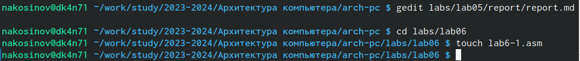{#fig:fig1 width=70%}

2. Напишем программу, вычисляющую сумму символов '4' и '6'. Программа выведет результат командой **sprintLF** из подключаемого файла **in_out.asm**.

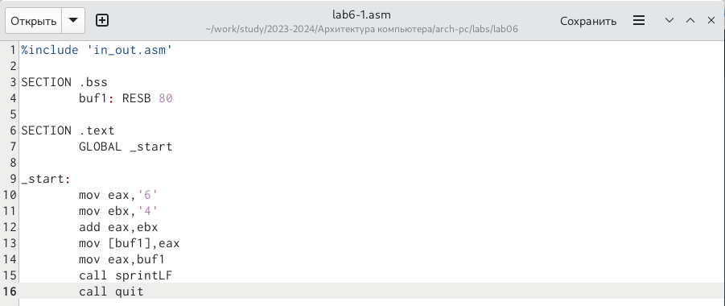{#fig:fig1 width=70%}

```
%include 'in_out.asm'

SECTION .bss
	buf1: RESB 80
	
SECTION .text
	GLOBAL _start

_start:
	mov eax,6
	mov ebx,4
	add eax,ebx
	mov [buf1],eax
	mov eax,buf1
	call sprintLF
	call quit
```

3. Скомпилируем и запустим написанную программу. 

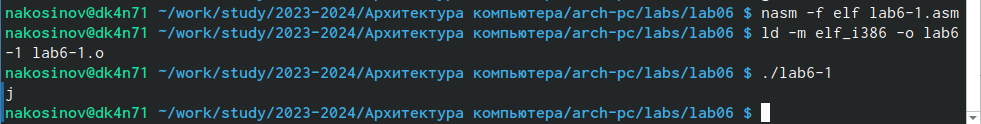{#fig:fig1 width=70%}

4. Мы видим, что результат исполнения - это символ 'j'. Программа так сработала, потому что при сложении символов она складывает их двоичные коды. Код символа '4' в системе *ASCII* равен 00110100, а код символа '6' - 00110110. Суммой этих кодов будет 01101010 (проверить это можно, например, сложив столбиком), что является кодом символа 'j'.

5. Изменим программу, убрав апострофы, тем самым заменив символы '4' и '6' в регистрах на соответствующие символы.

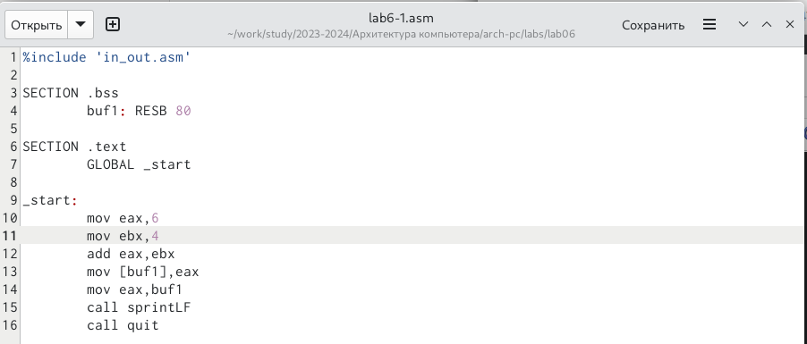{#fig:fig1 width=70%}

6. Скомпилируем полученную программу, запустим и посмотрим на результат.

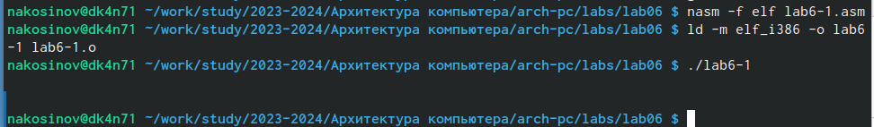{#fig:fig1 width=70%}

7. На первый взгляд, в консоли ничего не напечатано. Но это не так - обратим внимание на лишний образовавшийся отступ. Действительно, сумма чисел 4 и 6 равна 10, но команду вывода мы не поменяли, т.е. она показывает символ с кодом 10, а это как раз перенос каретки.

8. Снова изменим нашу программу. На этот раз добавим апострофы, чтобы складывать именно символы, но изменим вывод на **iprintLF**.

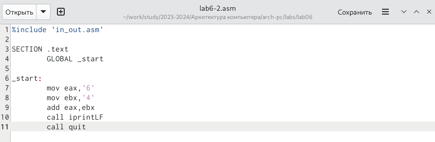{#fig:fig1 width=70%}

9. Скомпилируем и запустим.

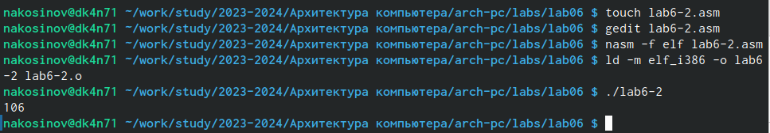{#fig:fig1 width=70%}

10. На терминале получаем число 106. Действительно, **iprint** вываодит уже численный результат операции, но складывали мы символы, а операция **add** при этом складывает их коды. Тем самым мы получаем в результате 01101010, как в первом случае, но теперь мы выводим этот код как число, причём в десятичной записи: $01101010 = 2^1+2^3+2^5+2^6 = 2+8+32+64 = 106$.

11. Снова изменим программу, оставив численный вывод и заменив символы на числа.

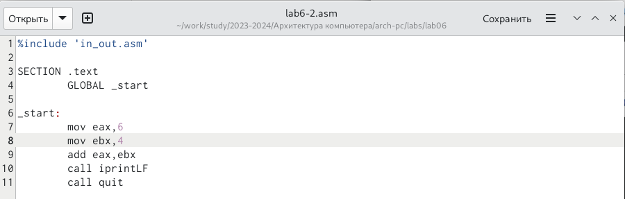{#fig:fig1 width=70%}

12. Скомпилируем и запустим.

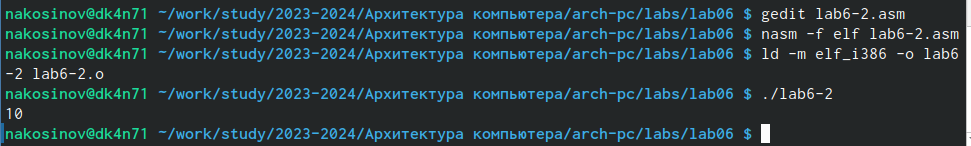{#fig:fig1 width=70%}

13. Мы, наконец, получаем результат сложения чисел 4 и 6.

14. В подключаемом файле **in_out.asm** наряду с командами **sprintLF** и **iprintLF** есть команды **sprint** и **iprint**. Чтобы понять разницу в их работе, изменим команду вывода в последней программе.

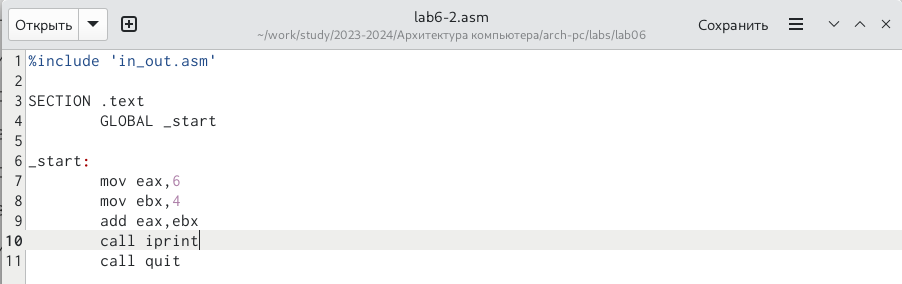{#fig:fig1 width=70%}

```
%include 'in_out.asm'

SECTION .text
	GLOBAL _start

_start:
	mov eax,6
	mov ebx,4
	add eax,ebx
	call iprint
	call quit
```

15. Скомпилируем и запустим.

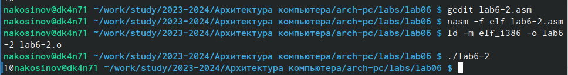{#fig:fig1 width=70%}

16. Результат: без добавленного **LF** в конце команды вывода, мы не получаем перенос строки на новую.

# Вычисление простейшего выражения на ассемблере

Выводить результат в численном виде мы научились, теперь разберём, как этот результат получить. Предлагается с помощью языка посчитать значения выражения $A:\frac{5\times 2+3}{3}$.

1. Напишем программу, вычисляющую данное выражение.

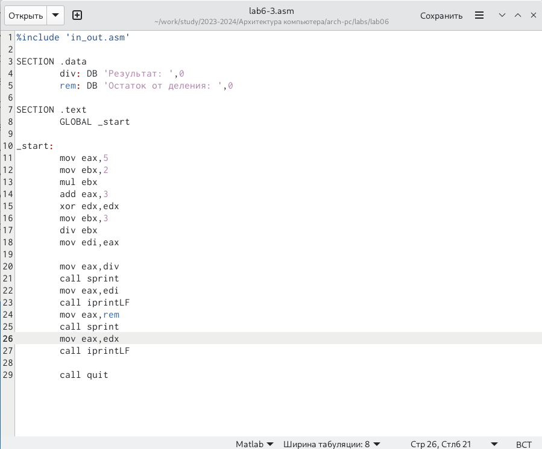{#fig:fig1 width=70%}

2. Разберём, что происходит в коде:

	2.1. Записываем 5 и 2 в регистры **eax** и **ebx**.
	
	2.2. Увеличиваем число из **eax**, т.е. 5, в число раз, записанное в **ebx**, т.е. 2. Получаем 10.
	
	2.3. Увеличиваем **eax**, равное 10, на 3.
	
	2.4. Обнуляем значение, оставшееся с прошлых разов в регистре **edx**.
	
	2.5. Записываем в **ebx** делитель - число 3.
	
	2.6. Делим число **eax** (13) на **ebx**. Неполное частное от деления (4) остаётся в **eax**, а остаток уходит в регистр **edx**.
	
	2.7. Для вывода нам нужен свободный регистр **eax**, поэтому мы переписываем полученное частное в другой - **edi**, дабы его не потерять.
	
	2.8. Последовательно выводим сообщения на экран и полученные значения.
	
3. Результат после компиляции.

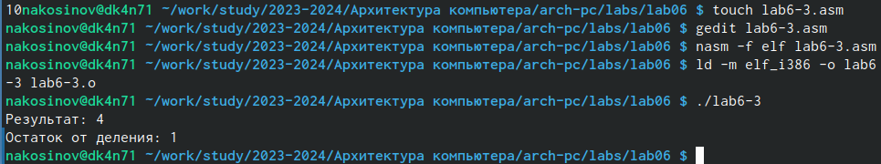{#fig:fig1 width=70%}

4. Изменим код программы для вычисления другого выражения: $B:\frac{4\times 6+2}{5}$.

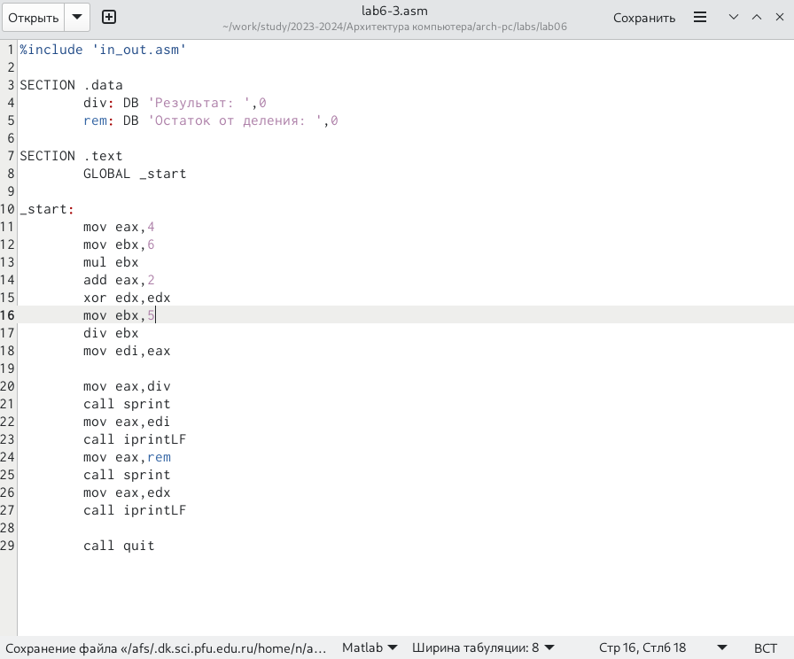{#fig:fig1 width=70%}

```
%include 'in_out.asm' 

SECTION .data
	div: DB 'Результат: ',0
	rem: DB 'Остаток от деления: ',0

SECTION .text
	GLOBAL _start

_start:
	mov eax,4 
	mov ebx,6 
	mul ebx 
	add eax,2 
	xor edx,edx
	mov ebx,5 
	div ebx 
	mov edi,eax 

	mov eax,div 
	call sprint 
	mov eax,edi 
	call iprintLF 
	mov eax,rem 
	call sprint 
	mov eax,edx 
	call iprintLF 
	
	call quit 
```

5. Скомпилируем и запустим. Убедимся, что программа выполнена корректно.

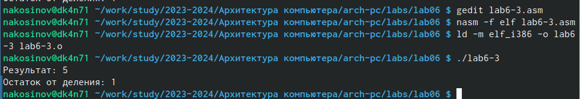{#fig:fig1 width=70%}

# Применение вычислений для практических задач

Разберём вариант задачи, где вычисления нужны для какой-то практической цели. Для большинства таких задач нам необходимо посчитать не просто значение какого-то числа, но в зависимости от введённых пользователем данных.

1. Напишем программу, вычисляющую номер варианта работы по номеру студенческого билета, как остаток от деления этого номера на 20 (количество вариантов).

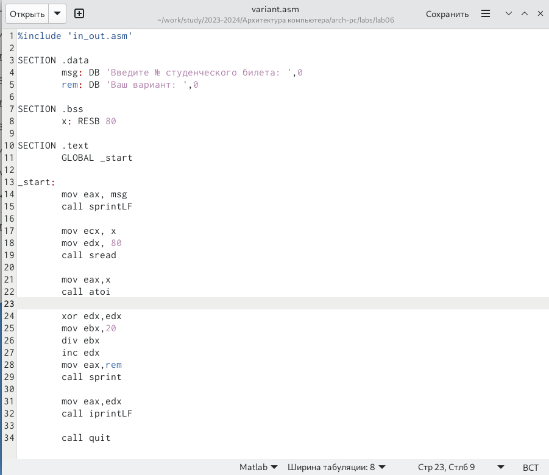{#fig:fig1 width=70%}

```
%include 'in_out.asm'

SECTION .data
	msg: DB 'Введите № студенческого билета: ',0
	rem: DB 'Ваш вариант: ',0

SECTION .bss
	x: RESB 80

SECTION .text
	GLOBAL _start

_start:
	mov eax, msg
	call sprintLF
	
	mov ecx, x
	mov edx, 80
	call sread
	
	mov eax,x 
	call atoi
	
	xor edx,edx
	mov ebx,20
	div ebx
	inc edx
	mov eax,rem
	call sprint
	
	mov eax,edx
	call iprintLF
	
	call quit
```

2. Разберём код:

	2.1. Сохраняем стандартные сообщения для общения с пользователем в переменные **msg** и **rem**.
	
	2.2. Выведем сообщение, предлагающие ввести номер билета.
	
	2.3. Считываем номер билета, предварительно подготовив регистры **ecx** и **edx**.
	
	2.4. Переносим билет в рабочий регистр **eax**, с которым и будем проводить операции. Функцией **atoi** из подключаемого файла преобразуем объект в регистре из кода в число.
	
	2.5. Считаем остаток от деления на 20. Он сохраняется в заранее обнулённом регистре **edx**.
	
	2.6. Остаток при делении на 20 может принимать значения от 0 до 19, а варианты заданий - от 1 до 20. Чтобы нормировать эти два набора, увеличим остаток на единицу инструкцией **inc**.
	
	2.7. Выведем на экран сообщение с результатом - номером варианта задания.
	
3. Скомпилируем и запустим. Ввожу номер своего студенческого билета: 1032189480.

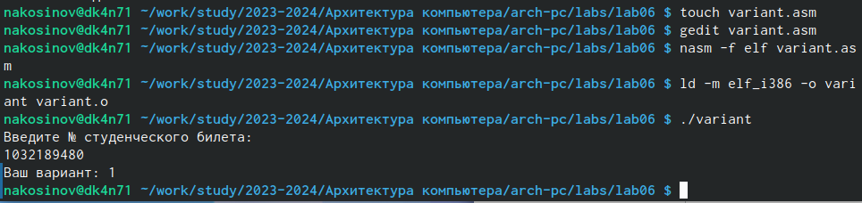{#fig:fig1 width=70%}
		
# Самостоятельная работа

При запуске предыдущей программы, мне по номеру билета выпал 1-й вариант. Действительно, 1032189480 делится нацело на 20. Поэтому самостоятельная работа состоит в вычислении значений выражения для $f(x)=\frac{10+2x}{3}$ с точностью до остатка для значений $x=1$ и $x=10$.

1. Напишем код программы. Добавим приглашающие сообщения и комментарии.

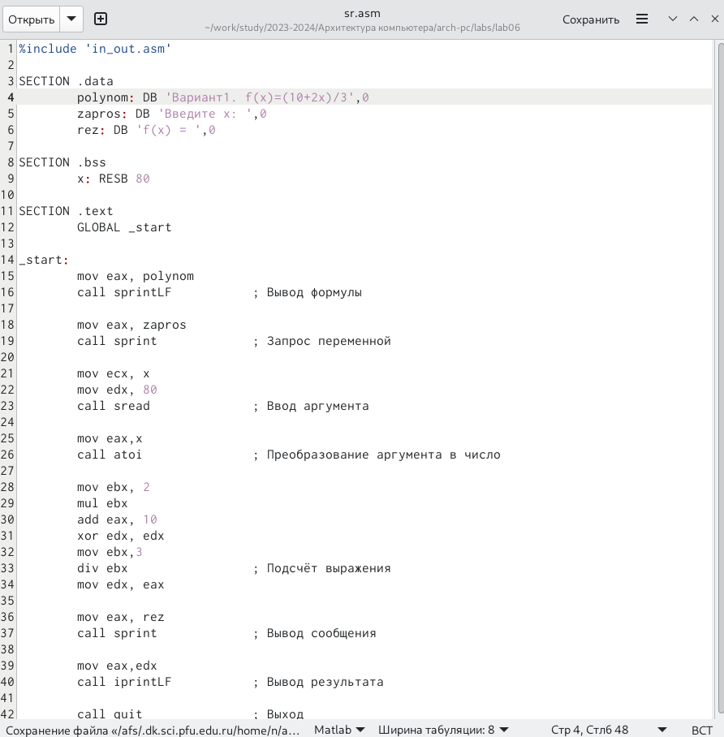{#fig:fig1 width=70%}

```
%include 'in_out.asm'

SECTION .data
	polynom: DB 'Вариант1. f(x)=(10+2x)/3',0
	zapros: DB 'Введите x: ',0
	rez: DB 'f(x) = ',0

SECTION .bss
	x: RESB 80

SECTION .text
	GLOBAL _start

_start:
	mov eax, polynom
	call sprintLF 		; Вывод формулы
	
	mov eax, zapros
	call sprint 		; Запрос переменной
	
	mov ecx, x
	mov edx, 80
	call sread 		; Ввод аргумента
	
	mov eax,x 
	call atoi 		; Преобразование аргумента в число
	
	mov ebx, 2
	mul ebx		
	add eax, 10		
	xor edx, edx
	mov ebx,3		
	div ebx 		; Подсчёт выражения
	mov edx, eax
	
	mov eax, rez
	call sprint		; Вывод сообщения
	
	mov eax,edx
	call iprintLF		; Вывод результата
	
	call quit		; Выход
```

2. Скомпилируем и запустим. Убедимся, что результат выполнения верный. Действительно, $\frac{10+2\times 1}{3} = \frac{12}{3}=4$ и $\frac{10+2\times 10}{3} = \frac{30}{3} = 10$.

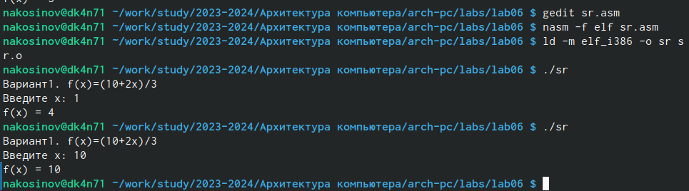{#fig:fig1 width=70%}

# Выводы

В ходе данной лабораторной работы мы научились пользоваться основными арифметическими операциями, выводить результат вычислений на экран в десятичной форме с помощью подключаемого файла, а также рассмотрели, как работает операция сложения для нечисленных объектов.


::: {#refs}
:::
