---
## Front matter
title: "РУДН. Архитектура компьютеров"
subtitle: "Отчёт по лабораторной работе №7"
author: "Косинов Никита Андреевич, НПМбв-02-20"

## Generic otions
lang: ru-RU
toc-title: "Содержание"

## Bibliography
bibliography: bib/cite.bib
csl: pandoc/csl/gost-r-7-0-5-2008-numeric.csl

## Pdf output format
toc: true # Table of contents
toc-depth: 2
lof: true # List of figures
lot: true # List of tables
fontsize: 12pt
linestretch: 1.5
papersize: a4
documentclass: scrreprt
## I18n polyglossia
polyglossia-lang:
  name: russian
  options:
	- spelling=modern
	- babelshorthands=true
polyglossia-otherlangs:
  name: english
## I18n babel
babel-lang: russian
babel-otherlangs: english
## Fonts
mainfont: PT Serif
romanfont: PT Serif
sansfont: PT Sans
monofont: PT Mono
mainfontoptions: Ligatures=TeX
romanfontoptions: Ligatures=TeX
sansfontoptions: Ligatures=TeX,Scale=MatchLowercase
monofontoptions: Scale=MatchLowercase,Scale=0.9
## Biblatex
biblatex: true
biblio-style: "gost-numeric"
biblatexoptions:
  - parentracker=true
  - backend=biber
  - hyperref=auto
  - language=auto
  - autolang=other*
  - citestyle=gost-numeric
## Pandoc-crossref LaTeX customization
figureTitle: "Рис."
tableTitle: "Таблица"
listingTitle: "Листинг"
lofTitle: "Список иллюстраций"
lotTitle: "Список таблиц"
lolTitle: "Листинги"
## Misc options
indent: true
header-includes:
  - \usepackage{indentfirst}
  - \usepackage{float} # keep figures where there are in the text
  - \floatplacement{figure}{H} # keep figures where there are in the text
---

# Цель работы

Кроме арифметических операций, нам необходимо выполнять логические. То есть, необходимо уметь сравнивать объекты: строки и числа, и, в зависимости от результата,выполнять то или иное действие. В языке Ассемблер предусмотрены такие переходы: без условия и с условием. Оба перехода происходят, например, с помощью меток, отличие в том, что переход в случае наличия условия происходит только при выполнении этого условия.

Цель данной работы - познакомиться с механикой условных и безусловных переходов языка Ассемблер.

# Ход работы

Лабораторная работа выполнена с использованием консоли **OC Linux** и языка программирования ассемблера **NASM**.

1. Безусловный переход;

2. Условный переход;

3. Файл листинга.

В конце выполнена самостоятельная работа.

# Безусловный переход

В начале работы познакомимся с тем, как в языке Ассемблер работает система меток.

1. Переходим в рабочий каталог и создайм файл формата **\*.asm**.

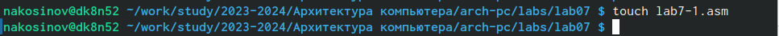{#fig:fig1 width=70%}

2. Напишем программу, использующую метки. Переход в участок программы происходит посредством команды **jmp**, далее код продолжает работать сверху вниз.

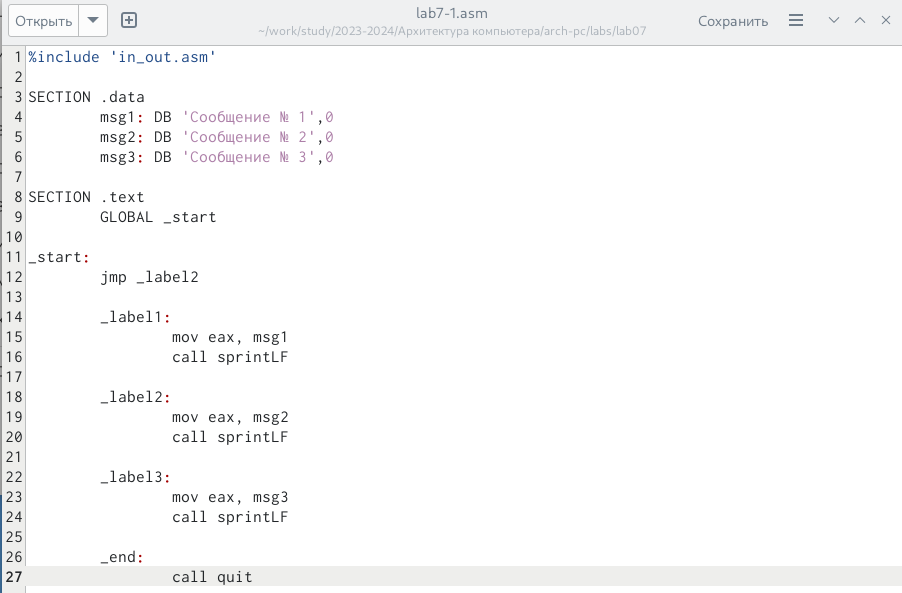{#fig:fig1 width=70%}

```
%include 'in_out.asm' 

SECTION .data
	msg1: DB 'Сообщение № 1',0
	msg2: DB 'Сообщение № 2',0
	msg3: DB 'Сообщение № 3',0

SECTION .text
	GLOBAL _start

_start:
	jmp _label2
	
	_label1:
		mov eax, msg1 
		call sprintLF 
		
	_label2:
		mov eax, msg2 
		call sprintLF 
	
	_label3:
		mov eax, msg3 
		call sprintLF 
	
	_end:
		call quit 
```

3. Скомпилируем и запустим.

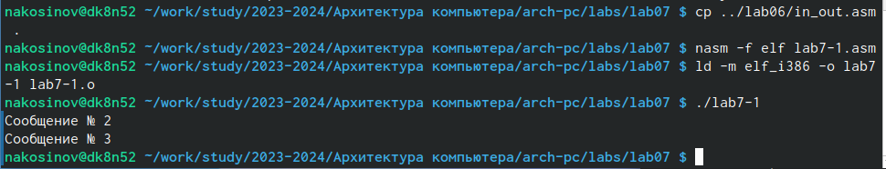{#fig:fig1 width=70%}

4. Мы видим, что из-за перехода на метку **_label2** в самом начале кода программа пропустила всё, написанное до этой метки, а именно вывод "Сообщение №1".

5. Изменим код программы, добавив переход из в конце второго блока в первый, а также переход с конца первого блока в финальный.

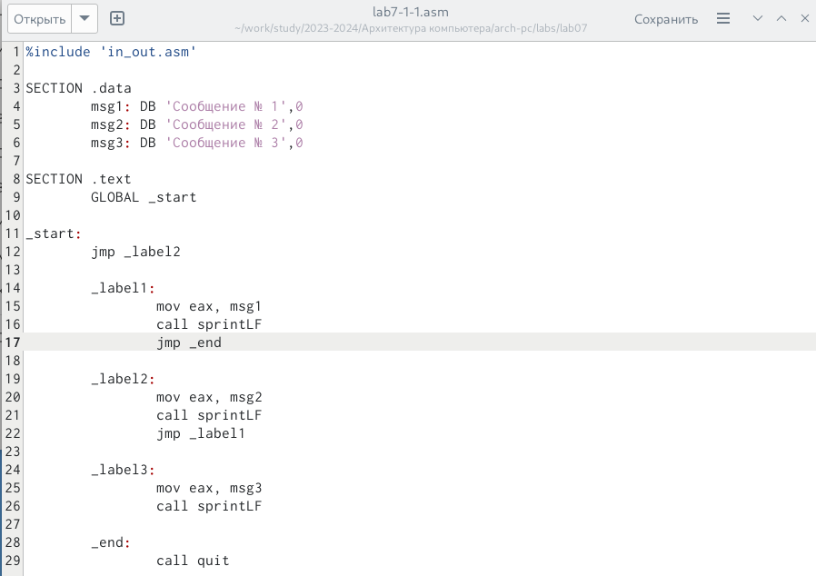{#fig:fig1 width=70%}

```
%include 'in_out.asm' 

SECTION .data
	msg1: DB 'Сообщение № 1',0
	msg2: DB 'Сообщение № 2',0
	msg3: DB 'Сообщение № 3',0

SECTION .text
	GLOBAL _start

_start:
	jmp _label2
	
	_label1:
		mov eax, msg1 
		call sprintLF 
		jmp _end
		
	_label2:
		mov eax, msg2 
		call sprintLF
		jmp _label1 
	
	_label3:
		mov eax, msg3 
		call sprintLF 
	
	_end:
		call quit 
```

6. Скомпилируем и запустим.

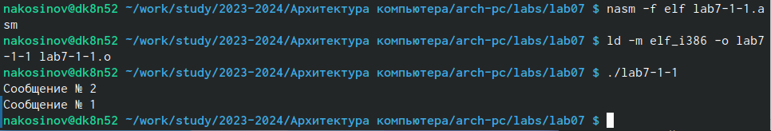{#fig:fig1 width=70%}

7. Как и ожидалось, сначала произошёл вывод 2-го сообщения, затем 1-го и выход из порграммы.

8. Изменим первый переход, поменяв 2-ю на 3-ю метку, а в третий блок программы добавим переход ко второй метке так, чтобы сообщения выводились в обратном порядке.

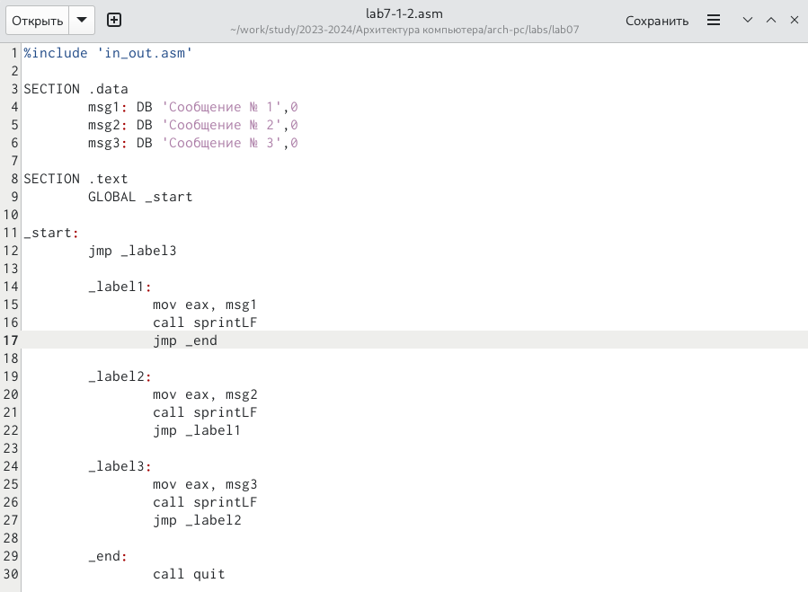{#fig:fig1 width=70%}

```
%include 'in_out.asm' 

SECTION .data
	msg1: DB 'Сообщение № 1',0
	msg2: DB 'Сообщение № 2',0
	msg3: DB 'Сообщение № 3',0

SECTION .text
	GLOBAL _start

_start:
	jmp _label3
	
	_label1:
		mov eax, msg1 
		call sprintLF 
		jmp _end
		
	_label2:
		mov eax, msg2 
		call sprintLF 
		jmp _label1
	
	_label3:
		mov eax, msg3 
		call sprintLF 
		jmp _label2
	
	_end:
		call quit 
```

9. Проверим результат

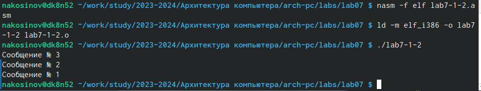{#fig:fig1 width=70%}
		
# Условный переход

Условный переход - это переход между частями кода, если выполнено некоторое условие. Инструкций по передаче управления по метке много, но все начинаются с буквы **j**, так как работают по принципу **jmp**, только с условием.

1. Напишем программу, определяющую максимум из трёх элементов. Две переменные зададим в самом коде, а третью попросим ввести с клавиатуры пользователя.

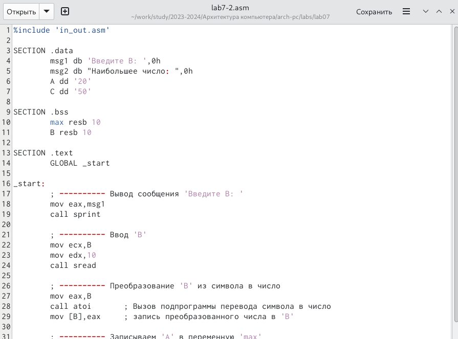{#fig:fig1 width=70%}

```
%include 'in_out.asm'

SECTION .data
	msg1 db 'Введите B: ',0h
	msg2 db "Наибольшее число: ",0h
	A dd '20'
	C dd '50'

SECTION .bss
	max resb 10
	B resb 10

SECTION .text
	GLOBAL _start

_start:
	; ---------- Вывод сообщения 'Введите B: '
	mov eax, msg1
	call sprint
	
	; ---------- Ввод 'B'
	mov ecx,B
	mov edx,10
	call sread
	
	; ---------- Преобразование 'B' из символа в число
	mov eax,B
	call atoi 	; Вызов подпрограммы перевода символа в число
	mov [B],eax 	; запись преобразованного числа в 'B'
	
	; ---------- Записываем 'A' в переменную 'max'
	mov ecx,[A] 	; 'ecx = A'
	mov [max],ecx 	; 'max = A'
	
	; ---------- Сравниваем 'A' и 'С' (как символы)
	cmp ecx,[C] 	; Сравниваем 'A' и 'С'
	jg check_B 	; если 'A>C', то переход на метку 'check_B',
	mov ecx,[C] 	; иначе 'ecx = C'
	mov [max],ecx 	; 'max = C'
	
	; ---------- Преобразование 'max(A,C)' из символа в число
	check_B:
	mov eax,max
	call atoi 	; Вызов подпрограммы перевода символа в число
	mov [max],eax 	; запись преобразованного числа в `max`
	
	; ---------- Сравниваем 'max(A,C)' и 'B' (как числа)
	mov ecx,[max]
	cmp ecx,[B] 	; Сравниваем 'max(A,C)' и 'B'
	jg fin 		; если 'max(A,C)>B', то переход на 'fin',
	mov ecx,[B] 	; иначе 'ecx = B'
	mov [max],ecx
	
	; ---------- Вывод результата
	fin:
	mov eax, msg2
	call sprint 	; Вывод сообщения 'Наибольшее число: '
	mov eax,[max]
	call iprintLF 	; Вывод 'max(A,B,C)'
	call quit 	; Выход
```

2. Разберём код:

	3.1. Первыми двумя блоками выведем приглашение ввести третье число и считаем его с клавиатуры.
	
	3.2. Преобразуем его в число функцией **atoi** подключенного файла.
	
	3.3. Запишем значение первой переменной в созданный буфер *max*.
	
	3.4. Сравним переменные *A* и *С* инструкцией **cmp**, но как символы. Так можно сделать, т.к. числа в десятичной записи сравниваются в лексикографическом порядке, и коды цифры в кодировке **ASCII** идут по возрастанию самих цифр.
	
	3.5. Результат сравнения переменных запишется в регистр флагов. Инструкция **jg** сработает в случае, если *A>C* и позволяет сразу перейти к сравнению *max=A* и *В*. В противном случае, поменяем значение *max* на *C*, и уже после перейдём к сравнению *max=C* и *В*.
	
	3.6. Находим максимум окончательно и выводим результат на экран.

3. Скомпилируем и запустим программу. Попробуем её в работе для разных значений третьей переменной. Убеждаемся, что программа работает корректно!

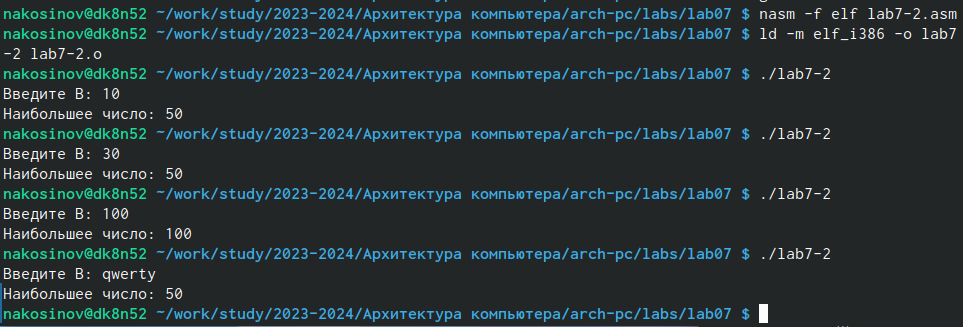{#fig:fig1 width=70%}

# Файл листинга

Файл листинга - документ, использующийся при отладке кода программы. Он содержит код на написанном языке, а также машинный код.

1. Создадим файл листинга предыдущей программы, указав ключ **-l** при создании объектного файла.

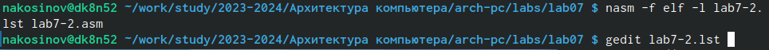{#fig:fig1 width=70%}

2. Рассмотрим структура созданного документа.

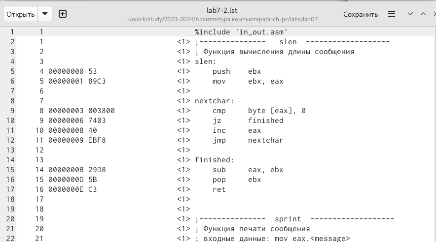{#fig:fig1 width=70%}

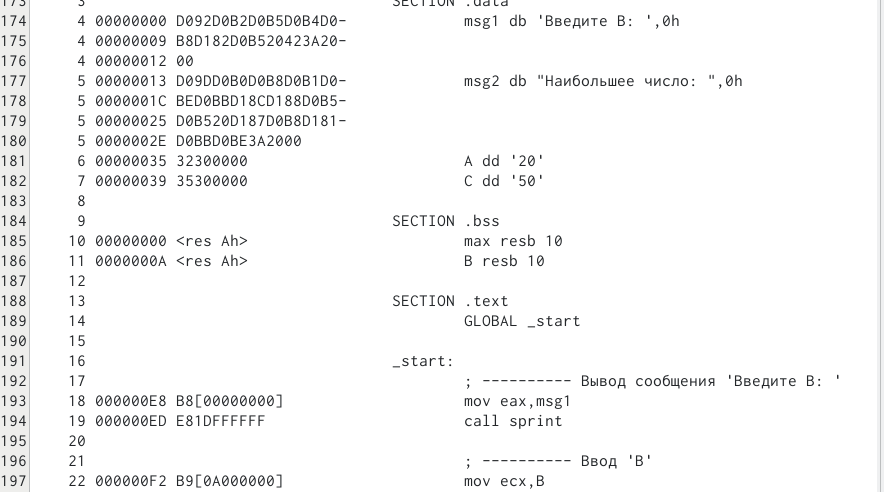{#fig:fig1 width=70%}

3. Проследим за структурой листинга:

	3.1. Номера строк исходной программы, причём в случае нескольких команд машинного кода по одной строке написанного нами, этот номер несколько раз дублируется.
	
	3.2. Адрес, на сколько мы сместились от начала сегмента.
	
	3.3. Машинный код каждой инструкции в шеснадцатиричной системе счисления.
	
	3.4. Исходный код программы и написанные в нём комментарии.
	
4. Изменим код, убрав из команды **mov** второй операнд.

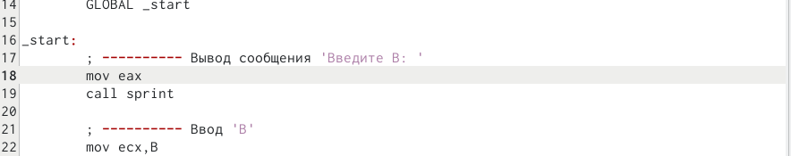{#fig:fig1 width=70%}

5. Попробуем создать файл листинга. Но у нас это не выйдет, так как в программе допущена ошибка *неправильное использование инструкции и операндов*. Соответственно, компиляция прерывается, и фапйл листинга не создаётся. Таким образом, последний нужен именно для отладки работающей программы, но не для поиска допущенных синтаксических ошибок.

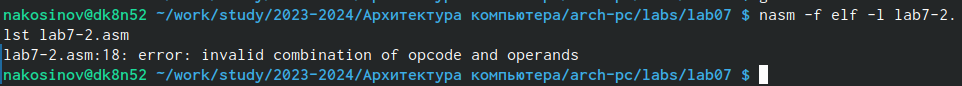{#fig:fig1 width=70%}

# Самостоятельная работа

Текущая самостоятельная работа состоит из двух задач **I** варианта.

1. В первой задаче требуется найти минимум значений трёх чисел: *a=17, b=23, c=45*. Напишем программу, добавив комментарии.

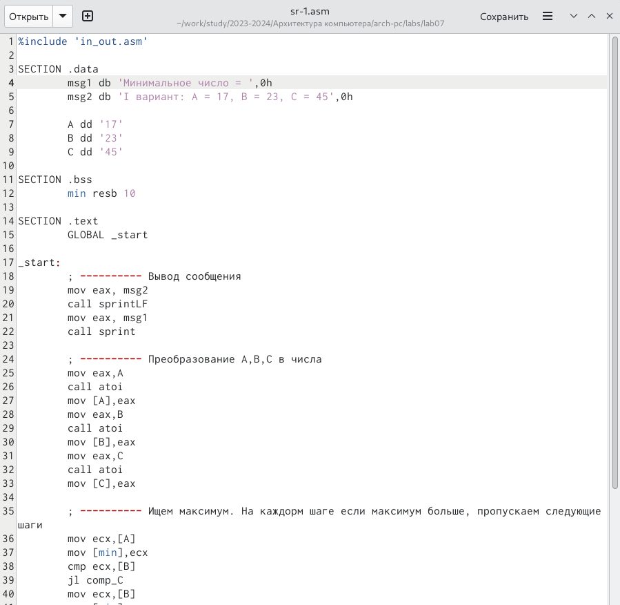{#fig:fig1 width=70%}
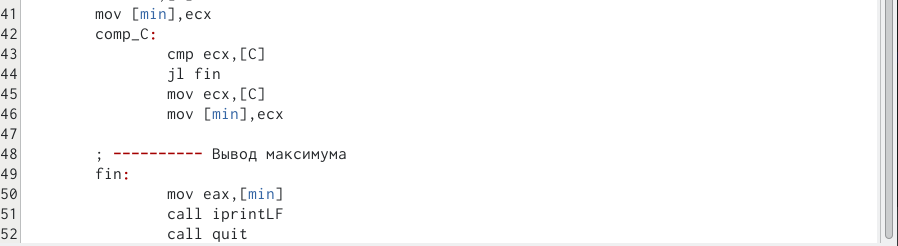{#fig:fig1 width=70%}

```
%include 'in_out.asm'

SECTION .data
	msg1 db 'Минимальное число = ',0h
	msg2 db 'I вариант: A = 17, B = 23, C = 45',0h
	
	A dd '17'
	B dd '23'
	C dd '45'

SECTION .bss
	min resb 10

SECTION .text
	GLOBAL _start

_start:
	; ---------- Вывод сообщения
	mov eax, msg2
	call sprintLF
	mov eax, msg1
	call sprint
	
	; ---------- Преобразование A,B,C в числа
	mov eax,A
	call atoi 	
	mov [A],eax 
	mov eax,B
	call atoi
	mov [B],eax
	mov eax,C
	call atoi
	mov [C],eax	
	
	; ---------- Ищем максимум. На каждорм шаге если максимум больше, пропускаем следующие шаги
	mov ecx,[A]
	mov [min],ecx
	cmp ecx,[B]
	jl comp_C
	mov ecx,[B]
	mov [min],ecx
	comp_C:
		cmp ecx,[C]
		jl fin
		mov ecx,[C]
		mov [min],ecx
	
	; ---------- Вывод максимума
	fin:
		mov eax,[min]
		call iprintLF 
		call quit 
```

2. Скомпилируем и запустим.

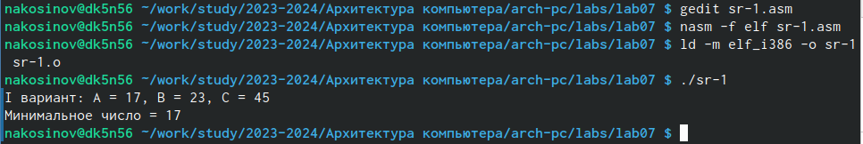{#fig:fig1 width=70%}

3. Во второй задаче требуется вычислить значение функции с условием, в зависимости от введённых с клавиатуры чисел и . Результатом должно быть число, равное , если  и число, если . Напишем код программы, добавив комментарии.

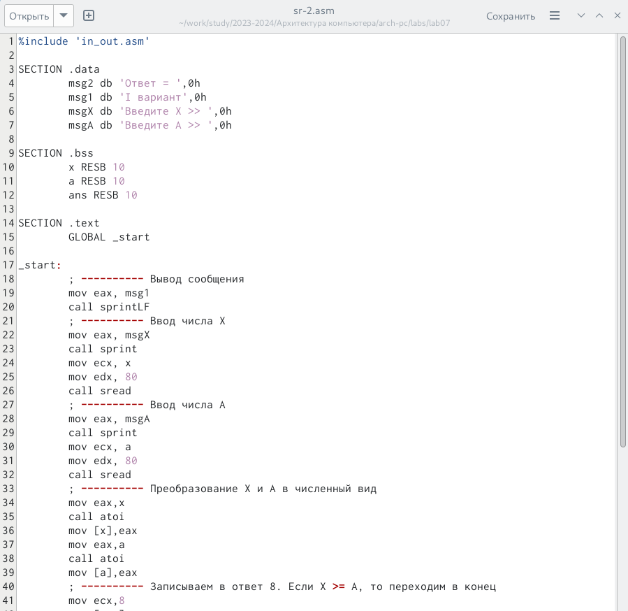{#fig:fig1 width=70%}

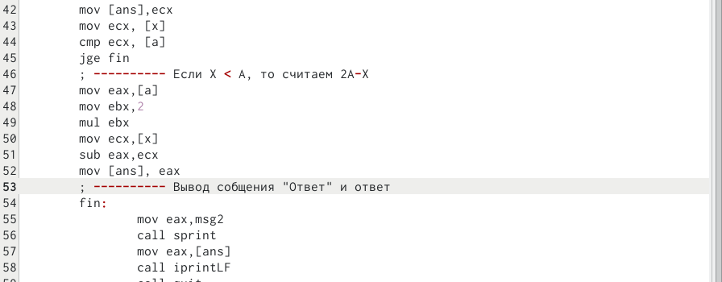{#fig:fig1 width=70%}

```
%include 'in_out.asm'

SECTION .data
	msg2 db 'Ответ = ',0h
	msg1 db 'I вариант',0h
	msgX db 'Введите X >> ',0h
	msgA db 'Введите A >> ',0h

SECTION .bss
	x RESB 10
	a RESB 10
	ans RESB 10
	
SECTION .text
	GLOBAL _start

_start:
	; ---------- Вывод сообщения
	mov eax, msg1
	call sprintLF
	; ---------- Ввод числа Х
	mov eax, msgX
	call sprint
	mov ecx, x
	mov edx, 80
	call sread 
	; ---------- Ввод числа А
	mov eax, msgA
	call sprint
	mov ecx, a
	mov edx, 80
	call sread
	; ---------- Преобразование Х и А в численный вид
	mov eax,x
	call atoi
	mov [x],eax
	mov eax,a
	call atoi
	mov [a],eax
	; ---------- Записываем в ответ 8. Если Х >= А, то переходим в конец
	mov ecx,8
	mov [ans],ecx
	mov ecx, [x]
	cmp ecx, [a]
	jge fin
	; ---------- Если Х < А, то считаем 2А-Х
	mov eax,[a]
	mov ebx,2
	mul ebx
	mov ecx,[x]
	sub eax,ecx
	mov [ans], eax
	; ---------- Вывод собщения "Ответ" и ответ
	fin:
		mov eax,msg2
		call sprint 
		mov eax,[ans]
		call iprintLF
		call quit 
```

4. Скомпилируем и запустим. Проверим работу программы на занчениях из варианта и пары собственных

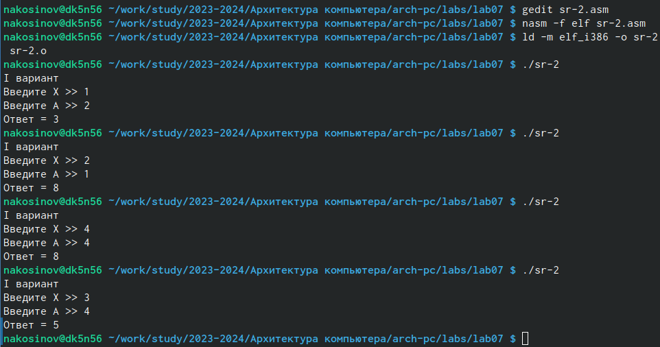{#fig:fig1 width=70%}

# Выводы

В ходе данной лабораторной работы мы научились пользоваться переходами между частями кода с условием и без, а также познакомились со структурой отладочного документа - файла листинга.


::: {#refs}
:::
