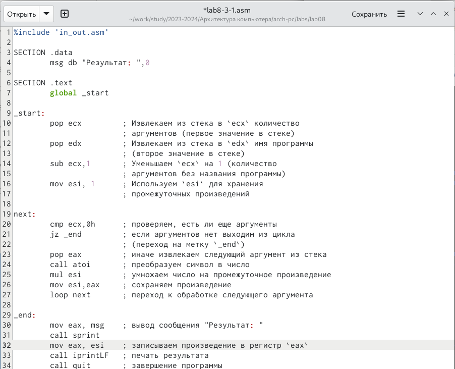
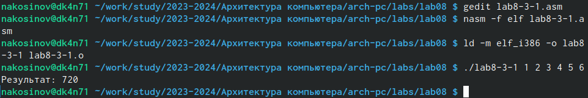

---
## Front matter
title: "РУДН. Архитектура компьютеров"
subtitle: "Отчёт по лабораторной работе №8"
author: "Косинов Никита Андреевич, НПМбв-02-20"

## Generic otions
lang: ru-RU
toc-title: "Содержание"

## Bibliography
bibliography: bib/cite.bib
csl: pandoc/csl/gost-r-7-0-5-2008-numeric.csl

## Pdf output format
toc: true # Table of contents
toc-depth: 2
lof: true # List of figures
lot: true # List of tables
fontsize: 12pt
linestretch: 1.5
papersize: a4
documentclass: scrreprt
## I18n polyglossia
polyglossia-lang:
  name: russian
  options:
	- spelling=modern
	- babelshorthands=true
polyglossia-otherlangs:
  name: english
## I18n babel
babel-lang: russian
babel-otherlangs: english
## Fonts
mainfont: PT Serif
romanfont: PT Serif
sansfont: PT Sans
monofont: PT Mono
mainfontoptions: Ligatures=TeX
romanfontoptions: Ligatures=TeX
sansfontoptions: Ligatures=TeX,Scale=MatchLowercase
monofontoptions: Scale=MatchLowercase,Scale=0.9
## Biblatex
biblatex: true
biblio-style: "gost-numeric"
biblatexoptions:
  - parentracker=true
  - backend=biber
  - hyperref=auto
  - language=auto
  - autolang=other*
  - citestyle=gost-numeric
## Pandoc-crossref LaTeX customization
figureTitle: "Рис."
tableTitle: "Таблица"
listingTitle: "Листинг"
lofTitle: "Список иллюстраций"
lotTitle: "Список таблиц"
lolTitle: "Листинги"
## Misc options
indent: true
header-includes:
  - \usepackage{indentfirst}
  - \usepackage{float} # keep figures where there are in the text
  - \floatplacement{figure}{H} # keep figures where there are in the text
---

# Цель работы

Многие логики программ требуют повторять одну и ту же оперцию несколько раз: фиксированное, либо зависящее от параметров, заданных пользователем. В любом случае, в Ассемблере предусмотрена такая возможность. 

Цель данной работы - научиться писать программы, использующие логику циклов, а также познакомиться со структорой стека.

# Ход работы

Лабораторная работа выполнена с использованием консоли **OC Linux** и языка программирования ассемблера **NASM**.

1. Реализация цикла фиксированной длины;

2. Реализация цикла, зависящего от аргументов;

3. Работа с аргументами.

В конце выполнена самостоятельная работа.

# Реализация цикла фиксированной длины

Чтобы организовать цикл в **NASM**, можно использовать инструкцию **loop**. Она уменьшает значение, хранящееся в регистре **ecx** на 1, и, если получает не ноль, переходит на указанную метку. Таким образом, метка указанная над командой **loop** возвращает нас на несколько шагов назад, но с новым значением **ecx**. Так мы получаем цикл на **ecx** операций.

1. Создаём рабочий файл.

{#fig:fig1 width=70%}

2. Пишем код с использованием цикла длины **N**, где последний вводится пользователем.

{#fig:fig1 width=70%}

3. Компилируем и запускаем. Изначально в **ecx** записывает число 5, далее каждую итерацию мы выводим его на экран и уменьшаем на 1. По достижении 0 программа завершает работу

{#fig:fig1 width=70%}

4. Изменим работу программы, добавив уменьшение **ecx** на 1 вручную.

{#fig:fig1 width=70%}

5. Запустим, попробовав **N=7** и **N=6**. Во втором случае видно, что выводятся числа с шагом 2. Действительно, **ecx** уменьшается дважды на 1 за одну итерацию: нами и инструкцией **loop**. В первом случае же, раз **N** нечётно, после 1 мы получим -1, т.е. не 0, и программы продолжит работу. При этом, -1 в **ecx** - это самое большое число, поэтому мы видим такой результат.

{#fig:fig1 width=70%}

6. Для исправления такого рода недочёта, можно перед изменением значения **ecx** его сохранить, например, в стек. А перед концом шага цикла достать обратно.

{#fig:fig1 width=70%}

7. Компилируем и запустим. Получим значения **ecx**, уменьшенные на 1.

{#fig:fig1 width=70%}

# Реализация цикла, зависящего от аргументов

При запуске программы есьт возможность указать какие-либо аргументы, которые программа может использовать. Попробуем написать код, который работате с введёнными с клавиатуры аргументами.

1. Пишем код программы: вывести указанные аргументы, каждый на новой строке. Количество аргументов при этом можно взять из стека аргументов, пропуская при этом название программы, также записанное в стек.

{#fig:fig1 width=70%}

2. Компилируем и запускаем.

{#fig:fig1 width=70%}

# Работа с аргументами

1. Попробуем сдлеать с аргументами что-то дополнительно, например, посчитать их сумму. 

{#fig:fig1 width=70%}

2. Компилируем и запускаем. Программа работает корректно: $1+2+3+...+10 = \dfrac{11\times 10}{2}=55$.

{#fig:fig1 width=70%}

3. Изменим программу, чтобы она считала произведение чисел. Не забываем "обнулить" регистр **esi** единицей.

{#fig:fig1 width=70%}

4. Запустим и посчитаем, например $6! = 720$.

{#fig:fig1 width=70%}

# Самостоятельная работа

В самостоятельной работе предлагается взять функцию $f(x)=2x+15$ и посчитать сумму значений этой функции от введённых аргументов. 

1. Напишем код с комментариями.

{#fig:fig1 width=70%}

{#fig:fig1 width=70%}

2. Скомпилируем и запустим несколько раз, указывая разные наборы аргументов. Убедимся, что во всех случаях программа работает корректно, в том числе, если аргументы не указаны.

{#fig:fig1 width=70%}

# Выводы

В ходе данной лабораторной работы мы познакомились со структурой стека, научились брать из автоматически созданного стека аргументы и их количество, реализовали работу с аргументами с использованием циклической структуры.

::: {#refs}
:::
