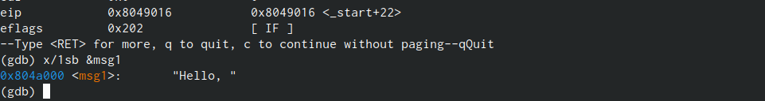
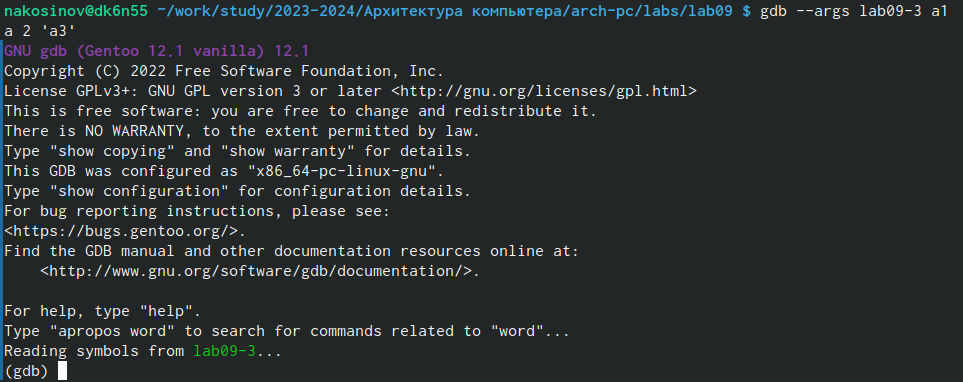
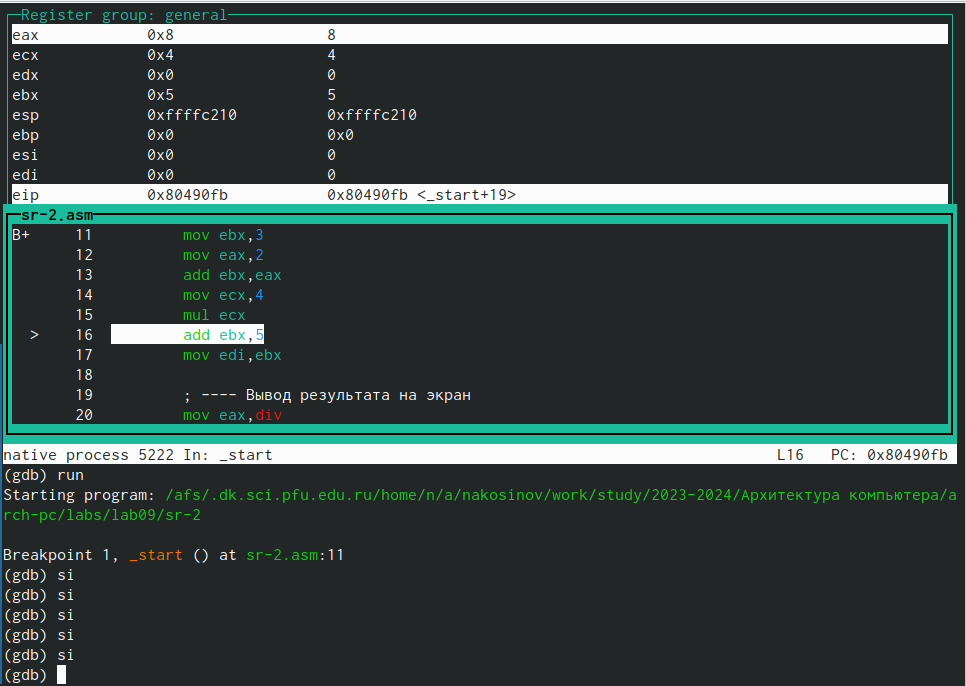

---
## Front matter
title: "РУДН. Архитектура компьютеров"
subtitle: "Отчёт по лабораторной работе №9"
author: "Косинов Никита Андреевич, НПМбв-02-20"

## Generic otions
lang: ru-RU
toc-title: "Содержание"

## Bibliography
bibliography: bib/cite.bib
csl: pandoc/csl/gost-r-7-0-5-2008-numeric.csl

## Pdf output format
toc: true # Table of contents
toc-depth: 2
lof: true # List of figures
lot: true # List of tables
fontsize: 12pt
linestretch: 1.5
papersize: a4
documentclass: scrreprt
## I18n polyglossia
polyglossia-lang:
  name: russian
  options:
	- spelling=modern
	- babelshorthands=true
polyglossia-otherlangs:
  name: english
## I18n babel
babel-lang: russian
babel-otherlangs: english
## Fonts
mainfont: PT Serif
romanfont: PT Serif
sansfont: PT Sans
monofont: PT Mono
mainfontoptions: Ligatures=TeX
romanfontoptions: Ligatures=TeX
sansfontoptions: Ligatures=TeX,Scale=MatchLowercase
monofontoptions: Scale=MatchLowercase,Scale=0.9
## Biblatex
biblatex: true
biblio-style: "gost-numeric"
biblatexoptions:
  - parentracker=true
  - backend=biber
  - hyperref=auto
  - language=auto
  - autolang=other*
  - citestyle=gost-numeric
## Pandoc-crossref LaTeX customization
figureTitle: "Рис."
tableTitle: "Таблица"
listingTitle: "Листинг"
lofTitle: "Список иллюстраций"
lotTitle: "Список таблиц"
lolTitle: "Листинги"
## Misc options
indent: true
header-includes:
  - \usepackage{indentfirst}
  - \usepackage{float} # keep figures where there are in the text
  - \floatplacement{figure}{H} # keep figures where there are in the text
---

# Цель работы

При достаточно больших проектах часто требуется повторять одну и ту же операцию. Если их повторять подряд, то можно использовать циклы, но они не помогут для каких-то базовых часто используемых инструкций, таких как, например, ввод и вывод, возведение числа в степень и т.п. Для этого можно писать подпрограммы, внутри исходного файла, либо внутри подключаемого.

Также бывает довольно сложно в написанной неверно программе "глазами" найти в коде ошибку. Для решения этой проблемы созданы отладчики.

Цель данной работы заключается в освоении принципа написания подпрограмм и отладка программ с помощью отладчика **GDB**.

# Ход работы

Лабораторная работа выполнена с использованием консоли **OC Linux** и языка программирования ассемблера **NASM**.

1. Написание подпрограммы;

2. Отладка программ: точки останова;

3. Работа с данными через **GDB**;

4. Работа с аргументами через **GDB**.

В конце выполнена самостоятельная работа.

# Написание подпрограммы

Для удобства написания программ и чтобы разобраться с работой подключаемых файлов, разберёмся с написанием подпрограммы.

1. Создаём рабочий файл.

{#fig:fig1 width=70%}

2. Напишем программу, считающую $f(x)=2x+7$ для $x$, введённого с клавиатуры.

{#fig:fig1 width=70%}

```
%include 'in_out.asm'

SECTION .data
	msg: DB 'Введите x: ',0
	result: DB '2x+7=',0

SECTION .bss
	x: RESB 80
	res: RESB 80
SECTION .text
	GLOBAL _start

_start:
;------------------------------------------
; Основная программа
;------------------------------------------
	mov eax, msg
	call sprint
	
	mov ecx, x
	mov edx, 80
	call sread
	
	mov eax,x
	call atoi
	
	call _calcul ; Вызов подпрограммы _calcul
	
	mov eax,result
	call sprint
	mov eax,[res]
	call iprintLF
	call quit
;------------------------------------------
	; Подпрограмма вычисления
	; выражения "2x+7"
	_calcul:
		mov ebx,2
		mul ebx
		add eax,7
		mov [res],eax
		ret ; выход из подпрограммы
```

3. В этой программе этап вычисления функции $f(x)$ вынесен в конец программы с меткой *calcul*.

4. Компилируем и запускаем.

{#fig:fig1 width=70%}

5. Изменим программу так, чтобы она считала значение $f(g(x))$, где $g(x)=3x-1$. Вынесем этап вычисления $g(x)$ в подпрограмму *subcalcul*, а в функции *calcul* вызовем её для подстановки.

{#fig:fig1 width=70%}

```
%include 'in_out.asm'

SECTION .data
	msg: DB 'Введите x: ',0
	result: DB '2(3x-1)+7=',0

SECTION .bss
	x: RESB 80
	res: RESB 80
SECTION .text
	GLOBAL _start

_start:
;------------------------------------------
; Основная программа
;------------------------------------------
	mov eax, msg
	call sprint
	
	mov ecx, x
	mov edx, 80
	call sread
	
	mov eax,x
	call atoi
	
	call _calcul ; Вызов подпрограммы _calcul
	
	mov eax,result
	call sprint
	mov eax,[res]
	call iprintLF
	call quit
;------------------------------------------
	; Подпрограмма вычисления
	; выражения "2x+7"
	_calcul:
		call _subcalcul
		mov ebx,2
		mul ebx
		add eax,7
		mov [res],eax
		ret ; выход из подпрограммы
;------------------------------------------
	;Подпрограмма вычисления "3х-1"
	_subcalcul:
		mov ebx,3
		mul ebx
		add eax,-1
		ret
```

6. Компилируем, запускаем и проверяем корректность работы.

{#fig:fig1 width=70%}

# Отладка программ: точки останова

Данный раздел посвящён, в основном, точкам останова: местам в программе, на которых должно приостановиться её исполнение. Это необходимо, чтобы тщательнее изучить работу программы.

1. Для экспериментов с отладчиком **GDB** создаём файл *"Hello, world!"*

{#fig:fig1 width=70%}

```
SECTION .data
	msg1: db "Hello, ",0x0
	msg1Len: equ $ - msg1
	msg2: db "world!",0xa
	msg2Len: equ $ - msg2

SECTION .text
	global _start

_start:
	mov eax, 4
	mov ebx, 1
	mov ecx, msg1
	mov edx, msg1Len
	int 0x80
	mov eax, 4
	mov ebx, 1
	mov ecx, msg2
	mov edx, msg2Len
	int 0x80
	mov eax, 1
	mov ebx, 0
	int 0x80
```

2. Компилируем её с ключом **-g**, чтобы работать с ней в отладчике. Запустим для проверки корректности работы и открываем исполняемый файл с командой **gdb**.

{#fig:fig1 width=70%}

3. В первую очередь, поставим точку останова на самое начало прогнраммы - метку *start*.

{#fig:fig1 width=70%}

4. Посмотрим преобразованный код с помощью команды *disassemble* с метки *start*.

{#fig:fig1 width=70%}

5. Посмотриим на этот код в синтаксисе **Intel**. Видим, что его особенность в наличии подсветки и замене местами регистров и адресов значений в них.

{#fig:fig1 width=70%}

6. Запустим псевдографику командами *layout* с аргументами *asm*, для просмотра кода, и *regs*, для просмотра значений регистров.

{#fig:fig1 width=70%}

7. Вспомним, где мы поставили метку, с помощью сокращённой версии команды *info breakpoints*.

{#fig:fig1 width=70%}

8. Запустим нашу программу командой *run*. Увидим, что она остановила своё выполнение на 1-й и пока единственной точке останова на метке *start*.

{#fig:fig1 width=70%}

9. Поставим ещё одну точку останова на предпоследней инструкции по её адресу. Проверим командой *i b*.

{#fig:fig1 width=70%}

# Работа с данными через **GDB**

Программу гораздо легче исправлять, если видны изменения её объектов *"step_by_step"*.

1. Выполним несколько инструкций *stepi*. Так мы реализуем её пошаговое исполнение от инструкции к инструкции.

{#fig:fig1 width=70%}

2. Посмотрим на текущие значение регистров командой *info registers*.

{#fig:fig1 width=70%}

3. Выведем на экран текущее значений переменной *msg1* по её названию.

{#fig:fig1 width=70%}

4. Также можно выводить значение переменной по её адресу. Выведем так значение *msg2*.

{#fig:fig1 width=70%}

5. Изменим значение переменной *msg1* командой *set*. Для этого укажем тип данных, название переменной (обязательно с символом "&"!), и значение, которое хотим записать. При этом у нас поменяется только первый символ, т.к. *msg1* занимает несколько бит, а мы изменяем только первый. Таким образом имя переменной здесь работает непосредственно как указатель на первую ячейкеу выделенной под неё памяти.

{#fig:fig1 width=70%}

6. Изменим значения символов *msg2*, указывая адреса ячеек, чтобы поменять не только первый символ. Сокращённой версией команды *continue* завершим исполнение программы. Видим успешную замену и вывод *Hello, Lord!*

{#fig:fig1 width=70%}

7. Также можно изменять значения регистра. Изменим значение *ebx* на символьную *'2'* и выведем в разных форматах. Видим, что формат */s* выводит нам номер этого символа в десчтичной форме, а форматы */t* и */x* - в двоичной и шестнадцатиричной формах. 

{#fig:fig1 width=70%}

# Работа с аргументами через **GDB**

Данный раздел посвящён отладке программы, запуск которой предполагает ввод аргументов.

1. Скопируем программу вывода введённых аргументов на экран из 8-й лабораторной работы. Дадим ему новое имя и скомпилируем, не забыв ключ **-g**.

{#fig:fig1 width=70%}

```
%include 'in_out.asm'

SECTION .text
	global _start

_start:
	pop ecx 	; Извлекаем из стека в `ecx` количество
			; аргументов (первое значение в стеке)
	pop edx 	; Извлекаем из стека в `edx` имя программы
			; (второе значение в стеке)
	sub ecx, 1 	; Уменьшаем `ecx` на 1 (количество
			; аргументов без названия программы)
	
next:
	cmp ecx, 0 	; проверяем, есть ли еще аргументы
	jz _end 	; если аргументов нет выходим из цикла
			; (переход на метку `_end`)
	pop eax 	; иначе извлекаем аргумент из стека
	call sprintLF 	; вызываем функцию печати
	loop next 	; переход к обработке следующего
			; аргумента (переход на метку `next`)
	
_end:
	call quit
```

2. Откроем программу в **GDB**, указав ключ **-args** и 4 аргумента разных форматов.

{#fig:fig1 width=70%}

3. Установим точку останова на метку *start* и запустим программу. Выведем на экран значение регистра $esp$. Увидим адрес вершины стека и значение, там расположенное - 5. 

{#fig:fig1 width=70%}

4. 5 на 1 больше числа введённых нами аргументов. Это потому, что в стеке также хранится название самой программы. Убедимся в этом, выведя на экран все элементы, хранящиеся в стеке. Указываем шаг изменения адреса *"+4"*, т.к. на хранение одного адреса выделены 4б.

{#fig:fig1 width=70%}

# Самостоятельная работа

В первой задаче самостоятельной работы предлагается взять программу из восьмой лабораторной и оформить вычисление значения $f(x)=2x+15$ как подпрограмму. Во второй задаче дан код, выдающий неверный результат и требуется найти и исправить ошибку.

1. Скопируем самостоятельную работу из предыдущей лабораторной и изменим код, вынеся вычисление функции в подпрограмму.

{#fig:fig1 width=70%}

```
%include 'in_out.asm'

SECTION .data
	msg0 db "Вариант I",0
	msg1 db "Функция: f(x) = 2x+15 ",0
	msg2 db "Результат: ",0

SECTION .text
	global _start

_start:
	; ------- Выод приглашающих сообщений
	mov eax, msg0
	call sprintLF
	mov eax, msg1
	call sprintLF
	
	; ------- Подготовка стека аргументов и буфера для хранения промежуточных сумм
	pop ecx 	
	pop edx 	
	sub ecx,1 	
	mov esi, 0 	
	
	; ------- Проверяем, есть ли аргументы
	cmp ecx,0h
	jz _end

	; ------- Считаем в цикле f(x) и прибавляем к буферу esi
next:
	pop eax 	; извлекаем следующий аргумент из стека
	call atoi 	; преобразуем символ в число
	call _func	; считаем выражение f(x)
	add esi, eax
	loop next 	; переход к обработке следующего аргумента
	
	; ------- Вывод результата работы программы
_end:
	mov eax, msg2 	; вывод сообщения "Результат: "
	call sprint
	mov eax, esi 	; записываем произведение в регистр `eax`
	call iprintLF 	; печать результата
	call quit 	; завершение программы
	
	; ------- Считтаем значение f(x)
_func:
	mov ebx, 2
	mul ebx
	add eax, 15
	ret
```

2. Запустим и убедимся в корректности работы программы

{#fig:fig1 width=70%}

3. Для решения второй задачи скопируем код в *sr-2*.

{#fig:fig1 width=70%}

4. Скомпилируем и запустим. Ответ, который мы ожидаем увидеть $(2+3)\times 4+5 = 25$, но результат программы не тот.

{#fig:fig1 width=70%}

5. Откроем *sr-2* в *gdb*. Поставим точку останова на метке *start* и запустим программу командой *run*.

{#fig:fig1 width=70%}

6. Прогоняем программу командами *si*, по шагам. Первое, что бросается в глаза - результат сложения в строке 13 увеличил регистр *ebx*. Теперь там лежит значение 5.

{#fig:fig1 width=70%}

7. Ошибка: команда *mul* в строке 15 увеличивает значения регистра *eax*, но промежуточные значения мы храним в *ebx*. Следовательно ошибка логическая. 

{#fig:fig1 width=70%}

8. Нам надо поменять либо место хранения промежуточных значений, либо перед использованием *mul* поместить в *eax* значение из *ebx*, а затем выгрузить его обратно. Применим первый способ, как наименее трудоёмкий.

{#fig:fig1 width=70%}

```
%include 'in_out.asm'

SECTION .data
	div: DB 'Результат: ',0

SECTION .text
	GLOBAL _start

_start:
	; ---- Вычисление выражения (3+2)*4+5
	mov ebx,3
	mov eax,2
	add eax,ebx 	; Меняем местами регистры eax и ebx 
	mov ecx,4
	mul ecx
	add eax,5 	; Хранение промежуточного результата сейчас в eax
	mov edi,eax
	
	; ---- Вывод результата на экран
	mov eax,div
	call sprint
	mov eax,edi
	call iprintLF
	call quit
```

9. Компилируем и запускаем. Ответ верный, следовательно, ошибка исправлена успешно!

{#fig:fig1 width=70%}

# Выводы

В ходе данной лабораторной работы мы научились двум основным процессам программирования: выделение логических участков кода - подпрограмм, а также работе с отладчиком **GDB**, упрощающим поиск ошибок в коде или работе программы.


::: {#refs}
:::
