---
## Front matter
title: "РУДН. Архитектура компьютеров"
subtitle: "Отчёт по лабораторной работе №10"
author: "Косинов Никита Андреевич, НПМбв-02-20"

## Generic otions
lang: ru-RU
toc-title: "Содержание"

## Bibliography
bibliography: bib/cite.bib
csl: pandoc/csl/gost-r-7-0-5-2008-numeric.csl

## Pdf output format
toc: true # Table of contents
toc-depth: 2
lof: true # List of figures
lot: true # List of tables
fontsize: 12pt
linestretch: 1.5
papersize: a4
documentclass: scrreprt
## I18n polyglossia
polyglossia-lang:
  name: russian
  options:
	- spelling=modern
	- babelshorthands=true
polyglossia-otherlangs:
  name: english
## I18n babel
babel-lang: russian
babel-otherlangs: english
## Fonts
mainfont: PT Serif
romanfont: PT Serif
sansfont: PT Sans
monofont: PT Mono
mainfontoptions: Ligatures=TeX
romanfontoptions: Ligatures=TeX
sansfontoptions: Ligatures=TeX,Scale=MatchLowercase
monofontoptions: Scale=MatchLowercase,Scale=0.9
## Biblatex
biblatex: true
biblio-style: "gost-numeric"
biblatexoptions:
  - parentracker=true
  - backend=biber
  - hyperref=auto
  - language=auto
  - autolang=other*
  - citestyle=gost-numeric
## Pandoc-crossref LaTeX customization
figureTitle: "Рис."
tableTitle: "Таблица"
listingTitle: "Листинг"
lofTitle: "Список иллюстраций"
lotTitle: "Список таблиц"
lolTitle: "Листинги"
## Misc options
indent: true
header-includes:
  - \usepackage{indentfirst}
  - \usepackage{float} # keep figures where there are in the text
  - \floatplacement{figure}{H} # keep figures where there are in the text
---

# Цель работы

Очень часто программе необходимо взаимодействовать с файлами: записывать туда данные для дальнейшей работы, брать данные. Цель данной работы - разобраться, как можно создавать, открывать, записывать информацию в файле программой на языке ассемблер, а также разобраться, что такое права доступа и как их изменять.

# Ход работы

Лабораторная работа выполнена с использованием консоли **OC Linux** и языка программирования ассемблера **NASM**.

1. Изменение прав доступа;

2. Написание программы с записью в файл.

# Изменение прав доступа


1. Создаём рабочий файл.

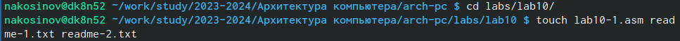{#fig:fig1 width=70%}

2. Пишем код программы, считывающей строку с терминала и записывающую эту строку в файл.

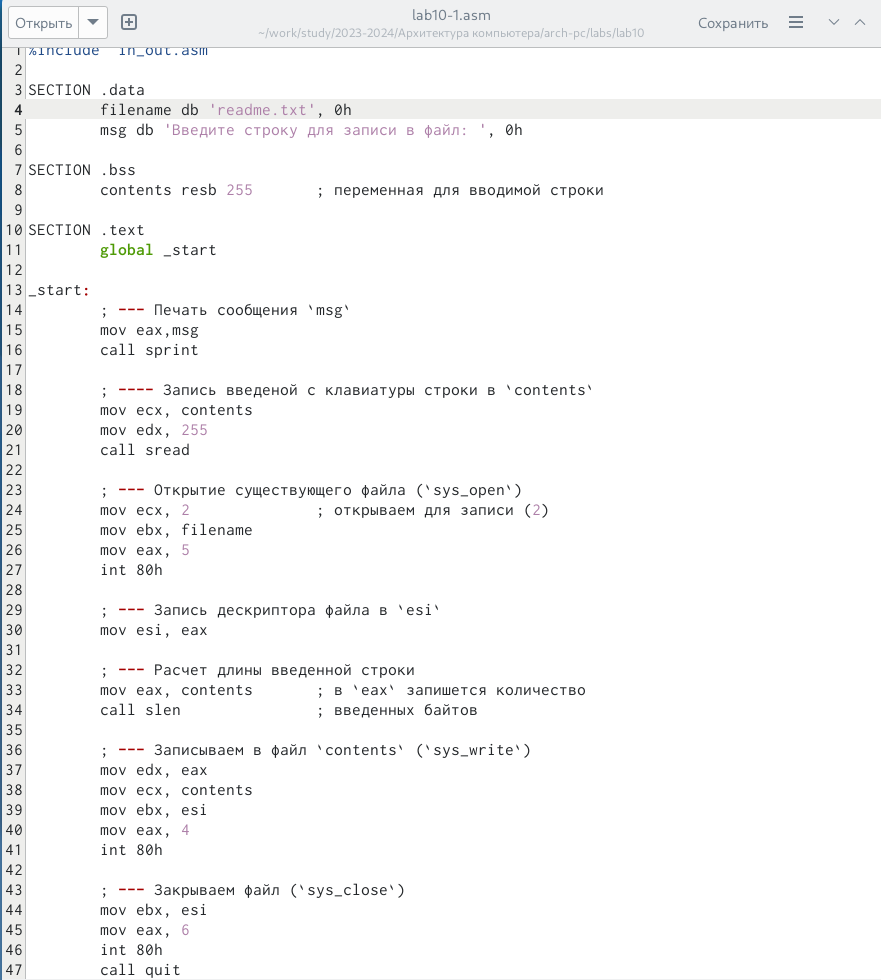{#fig:fig1 width=70%}

```
%include 'in_out.asm'

SECTION .data
	filename db 'readme.txt', 0h 
	msg db 'Введите строку для записи в файл: ', 0h 

SECTION .bss
	contents resb 255 	; переменная для вводимой строки

SECTION .text
	global _start

_start:
	; --- Печать сообщения `msg`
	mov eax,msg
	call sprint
	
	; ---- Запись введеной с клавиатуры строки в `contents`
	mov ecx, contents
	mov edx, 255
	call sread
	
	; --- Открытие существующего файла (`sys_open`)
	mov ecx, 2 		; открываем для записи (2)
	mov ebx, filename
	mov eax, 5
	int 80h
	
	; --- Запись дескриптора файла в `esi`
	mov esi, eax
	
	; --- Расчет длины введенной строки
	mov eax, contents 	; в `eax` запишется количество
	call slen 		; введенных байтов
	
	; --- Записываем в файл `contents` (`sys_write`)
	mov edx, eax
	mov ecx, contents
	mov ebx, esi
	mov eax, 4
	int 80h
	
	; --- Закрываем файл (`sys_close`)
	mov ebx, esi
	mov eax, 6
	int 80h
	call quit
```

3. Компилируем и исполняем. Видим, что первая попытка запуска неудачная, ведь в коде открывается уже существующий файл. Поэтому для проверки работы мы создадим файл *readme* и запустим ещё раз.

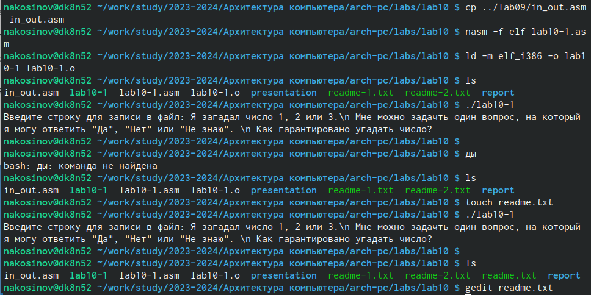{#fig:fig1 width=70%}

4. Откроем текстовый файл *readme* и убедимся, что программа работает корректно.

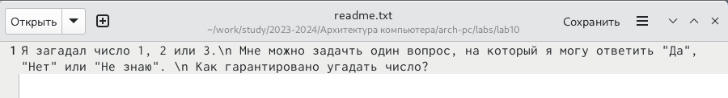{#fig:fig1 width=70%}

5. Изменим права доступа командой *chmod*, запретив исполнения для всех категорий пользователей. Проверим корректность командой *ls* с ключом **-l**. Видим, что у файла *lab10-1* в строке прав доступа отсутствуют буквы *x*. Ожидаемо, исполнить файл у нас не выходит.

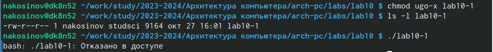{#fig:fig1 width=70%}

6. Добавим право запускать файл владельцу файла *lab10-1.asm*. Попробуем исполнить его. Но этот файл - не скомпилированная программа, и ЭВМ не понимает, как он может его исполнить, показывая нам, что не знает команд, введённых в этот файл.

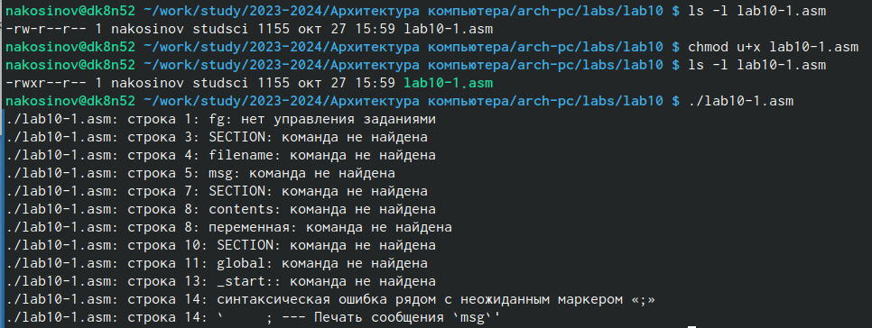{#fig:fig1 width=70%}

7. Изменим права доступа к файлу *readme-1* в символьном виде в соответствии с вариантом 1: *--x -wx rwx*.
В ходе нескольких попыток видим, что задать сразу все права таким образом не очень удобно: приходится вводить несколько команд.

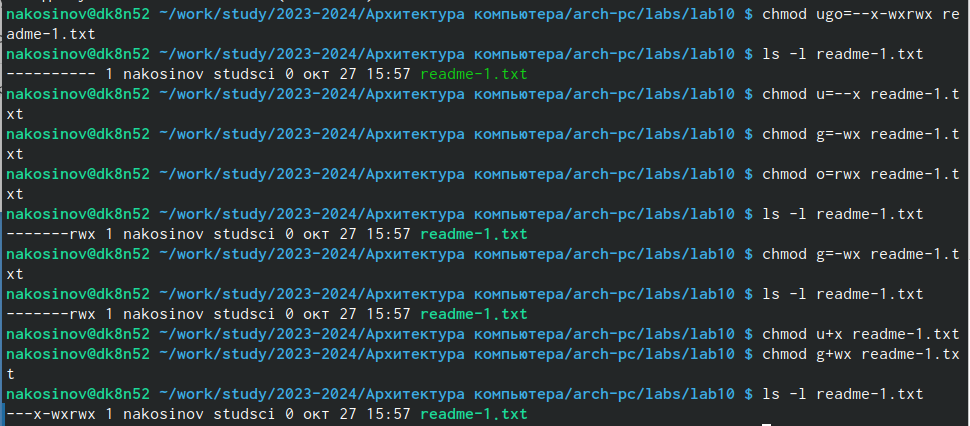{#fig:fig1 width=70%}

8. Изменим права доступа к файлу *readme-2* в двоичном виде в соответствии с вариантом 1: *000 110 010*. Для этого переводим каждую тройку бит в десчтичную цифру. Одной командой настраиваем права доступа полностью.

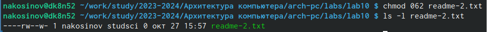{#fig:fig1 width=70%}

# Написание программы с записью в файл

Задание для самостоятельной работы заключается в написании программы, запрашивающей имя пользователя и записывающей этой имя в файл, добавляя в начало приветственные слова. 

1. Создаём файл с кодом программы и добавляем комментарии. 

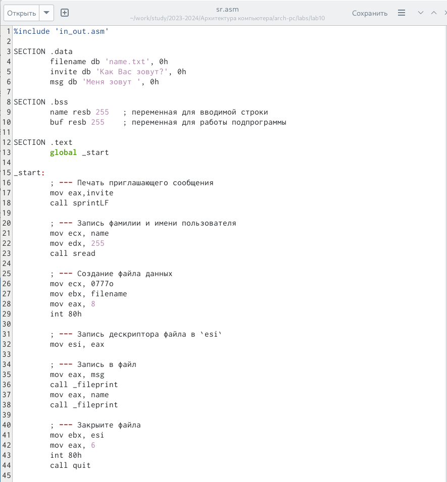{#fig:fig1 width=70%}

```
%include 'in_out.asm'

SECTION .data
	filename db 'name.txt', 0h 
	invite db 'Как Вас зовут?', 0h 
	msg db 'Меня зовут ', 0h

SECTION .bss
	name resb 255 	; переменная для вводимой строки
	buf resb 255 	; переменная для работы подпрограммы

SECTION .text
	global _start

_start:
	; --- Печать приглашающего сообщения
	mov eax,invite
	call sprintLF
	
	; --- Запись фамилии и имени пользователя
	mov ecx, name
	mov edx, 255
	call sread
	
	; --- Создание файла данных
	mov ecx, 0777o
	mov ebx, filename
	mov eax, 8
	int 80h
	
	; --- Запись дескриптора файла в `esi`
	mov esi, eax
	
	; --- Запись в файл
	mov eax, msg
	call _fileprint
	mov eax, name
	call _fileprint
	
	; --- Закрыите файла
	mov ebx, esi
	mov eax, 6
	int 80h
	call quit
	
	; --- Подпрограмма записи в файл
	_fileprint:
		mov ecx, eax
		call slen
		mov edx, eax
		mov ebx, esi
		mov eax, 4
		int 80h
		ret
```

2. В файл необходимо дважды записать сообщения: приветственное *"Меня зовут"* и непосредственно имя пользователя. Поэтому, для удобства, выносим печать в файл в подпрограмму *_fileprint*.

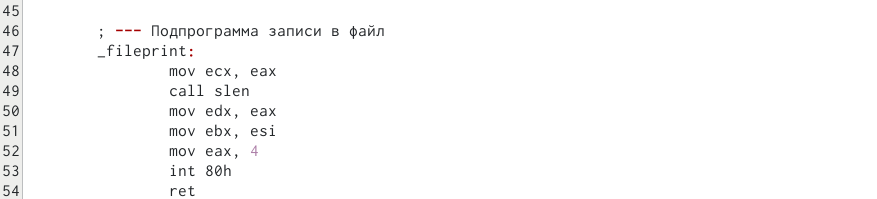{#fig:fig1 width=70%}

3. Компилируем программу и запускаем. Вводим свои имя и фамилию. Проверяем, что файл с именем создан командой *ls*. Командой *cat* проверяем, что в созданном файле данные сохранены и в нужном нам формате.

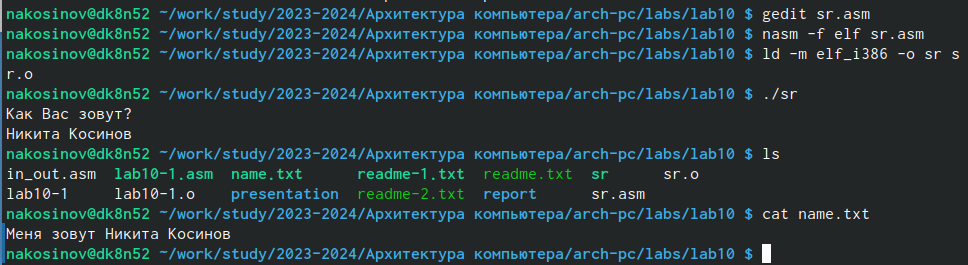{#fig:fig1 width=70%}

# Выводы

В ходе данной лабораторной работы мы научились работать с файлами средствами **NASM**, а также добавлять и отнимать права доступа к файлам разным группам пользователей через терминал.

::: {#refs}
:::
